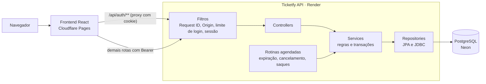

# Ticketfy API

[](https://github.com/rodrigolutfydev/Ticketfy-API/actions/workflows/ci.yml)
[](https://rodrigolutfydev.github.io/Ticketfy-API/jacoco/)

API de venda de ingressos que trata no banco de dados os problemas de verdade: a última vaga disputada, o clique duplo, o pagamento no instante da expiração e o mesmo ingresso lido por dois porteiros.

- **Site:** em breve
- **API:** [ticketfy-api.onrender.com](https://ticketfy-api.onrender.com/actuator/health)
- **Documentação:** veja a seção [Documentação](#documentação)

## O que o sistema faz

**Comprador**
- Encontra eventos por nome, cidade e destaque, e compra ingressos de um ou mais lotes, com cupom de desconto.
- Recebe ingressos com código único, transfere para outra pessoa e pede reembolso dentro do prazo.
- Baixa os próprios dados e exclui a conta.

**Organizador**
- Publica eventos, cria lotes e cupons, faz o check-in na entrada e cancela o evento com reembolso automático.
- Acompanha vendas, check-in e cupons no painel.
- Vê o saldo e o extrato, cadastra a chave Pix e pede saques.

**Administrador**
- Analisa, aprova ou recusa saques e bloqueia organizadores.
- Destaca eventos na vitrine.
- Consulta a auditoria das ações sensíveis.

## Destaques técnicos

- **Última vaga:** a reserva é um `UPDATE` condicional no estoque, coberto por teste com várias threads disputando o mesmo ingresso.
- **Sessões:** access token de 10 minutos e refresh token rotativo em cookie `HttpOnly`; logout e troca de senha valem na hora.
- **Dinheiro:** saldo derivado de um extrato imutável, com saque em análise e documento e chave Pix cifrados com AES-256-GCM.
- **Concorrência:** transferência, check-in, reembolso, cancelamento e exclusão de conta se serializam por uma ordem fixa de travas no banco.
- **Erros:** respostas no padrão RFC 7807 com `type` estável, e `X-Request-Id` em toda resposta e nos logs.
- **Privacidade:** exportação dos próprios dados e exclusão de conta por anonimização, numa única transação.

## Stack

| Camada | Tecnologia |
|---|---|
| Linguagem e framework | Java 17, Spring Boot 4.1 |
| Persistência | Spring Data JPA, Hibernate 7, PostgreSQL 16, Flyway |
| Segurança | Spring Security, JWT (java-jwt), BCrypt |
| Documentação | springdoc OpenAPI |
| Testes | JUnit 5, Testcontainers, JaCoCo |
| Entrega | Docker, GitHub Actions, Render, Neon |

## Arquitetura



O código é organizado por domínio (`event`, `order`, `ticket`, `payout` e outros), e cada pacote reúne controller, service, repository e DTOs. O raciocínio de cada decisão está no [documento de arquitetura](docs/05%20-%20Documento%20de%20Arquitetura.md).

## Como rodar localmente

Pré-requisitos: Java 17 ou mais recente e Docker.

1. Crie um `.env` na raiz (não versionado) com as variáveis obrigatórias:

   ```
   DB_PASSWORD=sua_senha
   JWT_SECRET=gere_com_openssl_rand_base64_32
   ```

   O perfil `dev` usa uma chave de desenvolvimento para cifrar os dados de recebimento. O perfil `prod` também exige `PAYOUT_ENCRYPTION_KEY` e `PROXY_SHARED_SECRET`. A lista completa de variáveis está na seção Config do [documento de arquitetura](docs/05%20-%20Documento%20de%20Arquitetura.md#config).

2. Suba o banco e a API:

   ```bash
   git clone https://github.com/rodrigolutfydev/Ticketfy-API.git
   cd Ticketfy-API
   docker compose up -d
   set -a; source .env; set +a
   ./mvnw spring-boot:run
   ```

   A API sobe em `http://localhost:8080`, o Flyway cria as tabelas e o Swagger fica em `/swagger-ui/index.html`.

3. Rode os testes (o Docker precisa estar rodando, porque os testes sobem um PostgreSQL descartável):

   ```bash
   ./mvnw verify
   ```

   O `verify` também atualiza o [`docs/openapi.json`](docs/openapi.json). Se você mudou algum endpoint, commite o arquivo junto, porque o CI falha quando ele está desatualizado.

## Documentação

**Referência**
- [Referência da API](docs/API.md)
- [Contrato OpenAPI](docs/openapi.json)

**Engenharia**
- [01 - Documento de Visão](docs/01%20-%20Documento%20de%20Vis%C3%A3o.md): problema, proposta, objetivos, público-alvo e escopo do Ticketfy, com as premissas e as questões em aberto.
- [02 - Documento de Requisitos](docs/02%20-%20Documento%20de%20Requisitos.md): os 18 requisitos funcionais, os não funcionais e as regras de negócio, com matriz de rastreabilidade e critérios de aceite.
- [03 - Caso de Uso UC01 - Compra de Ingresso](docs/03%20-%20Caso%20de%20Uso%20UC01%20-%20Compra%20de%20Ingresso.md): o fluxo de compra de ingresso com atores, fluxo principal, fluxos alternativos e de exceção, critérios de aceite e cenários de teste.
- [04 - Diagrama de Classes de Domínio](docs/04%20-%20Diagrama%20de%20Classes%20de%20Dom%C3%ADnio.md): as classes do domínio com atributos, enums, métodos e cardinalidades, e o diagrama UML em PlantUML.
- [05 - Documento de Arquitetura](docs/05%20-%20Documento%20de%20Arquitetura.md): camadas, fluxo de uma requisição, segurança, observabilidade, persistência e as decisões arquiteturais com suas limitações.

**Projeto**
- [Roadmap](docs/ROADMAP.md)

## Licença

MIT. Veja [LICENSE](LICENSE).
