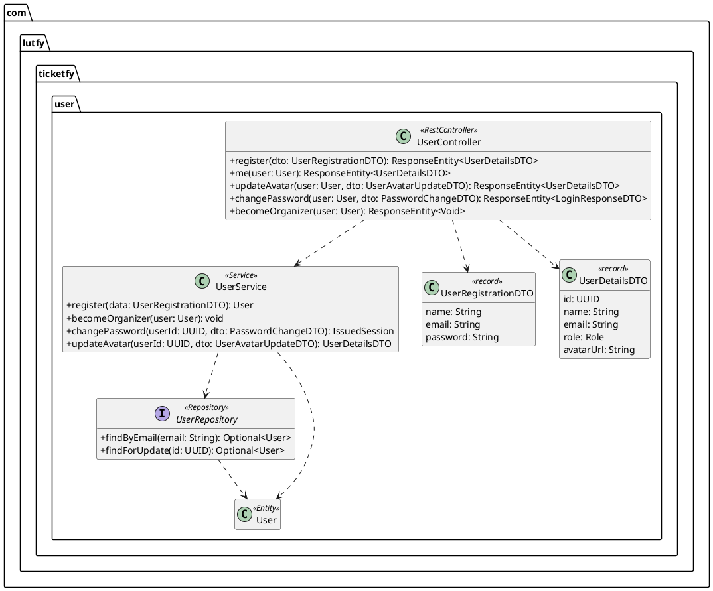

# Ticketfy 04 - Diagrama de Classes de Domínio

Oct 7, 2026

## Fonte da modelagem

Esta versão foi revisada contra o código, que é a fonte de verdade. Todas as classes descritas aqui existem no repositório: entidades JPA, enums e a tabela de auditoria, gravada por JDBC. A versão original combinava o domínio `user`, único implementado na época, com classes planejadas; as diferenças entre aquele modelo e o atual estão na seção "Conflitos identificados".

| Origem | Significado | Classes |
| --- | --- | --- |
| Entidade | Classe `@Entity` mapeada para uma tabela. | `User`, `Event`, `TicketType`, `Order`, `OrderItem`, `Payment`, `Ticket`, `TicketTransfer`, `Coupon`, `AuthSession`, `RefreshToken`, `LedgerEntry`, `PayoutAccount`, `Payout`, `PayoutBlock` |
| Tabela sem entidade | Tabela gravada e lida por JDBC, sem classe JPA. | `audit_log` |
| Enum | Conjunto fechado de valores, gravado como texto e protegido por CHECK no banco. | `Role`, `OrderStatus`, `PaymentMethod`, `PaymentStatus`, `TicketStatus`, `DiscountType`, `RevocationReason`, `LedgerEntryType`, `PayoutStatus`, `DocumentType`, `PixKeyType`, `AuditAction`, `AuditActorType`, `AuditTargetType` |

**Convenções**

- Nomes de classes e atributos em inglês, como no código do projeto.
- Os identificadores são `UUID`, gerados pelo banco (`gen_random_uuid()`) ou pela aplicação.
- Valores monetários usam `BigDecimal` (`NUMERIC(10,2)` no banco), e datas usam `Instant` (`TIMESTAMPTZ`).
- Os enums são gravados como texto (`@Enumerated(EnumType.STRING)`).

## Camadas: o que entra no diagrama de domínio

O diagrama de classes de domínio mostra apenas entidades e enums, porque são eles que representam os conceitos do negócio e o que é persistido no banco. As demais camadas descrevem como a aplicação processa esses conceitos e ficam em diagramas separados.

| Estrutura | Papel na arquitetura | Aparece no diagrama de domínio? | Onde representar |
| --- | --- | --- | --- |
| Entidades (`@Entity`) | Conceitos do negócio persistidos no banco, com seus atributos, regras internas e relacionamentos. | Sim | Diagrama de classes de domínio |
| Enums | Conjuntos fechados de valores usados pelas entidades, como perfis e status. | Sim, com estereótipo «enumeration» | Diagrama de classes de domínio |
| DTOs (records) | Contratos de entrada e saída da API. Evitam expor campos como `password` e impedem que o cliente defina campos como `role`. | Não | Diagrama de classes por módulo ou documentação da API (OpenAPI) |
| Services | Lógica de negócio que envolve mais de uma entidade e o controle de transações. | Não | Diagrama de classes por módulo ou diagrama de sequência |
| Repositories | Acesso aos dados via Spring Data JPA, incluindo os `UPDATE` condicionais de reserva, check-in e transferência. | Não | Diagrama de classes por módulo |
| Controllers | Exposição dos endpoints REST. | Não | Diagrama de classes por módulo ou de componentes |

### Exemplo real: módulo `user` em camadas

O módulo `user` mostra como as camadas se relacionam por dependência. Este diagrama é separado do diagrama de domínio.

As setas tracejadas são dependências: cada camada usa a seguinte, mas não guarda referência de negócio a ela. A troca de senha devolve uma sessão nova, porque revoga todas as anteriores; o `IssuedSession` vem do pacote `auth`.

## 1 e 2. Classes e responsabilidades

O domínio tem 15 entidades, 1 tabela sem entidade e 14 enums, organizados em quatro blocos: catálogo, vendas, financeiro do organizador e segurança e auditoria. "Organizador", "Participante", "Local" e "Validação" não viraram classes próprias; a justificativa está logo abaixo da tabela.

| Classe | Tipo | Pacote | Responsabilidade |
| --- | --- | --- | --- |
| `User` | Entidade | `user` | Representar qualquer pessoa com conta: cliente, organizador ou administrador. Guarda credenciais, perfil, foto e a data de exclusão da conta, e faz a promoção a organizador e a anonimização. |
| `Role` | Enum | `user` | Definir o perfil de acesso do usuário. |
| `Event` | Entidade | `event` | Representar um evento, seu local, seu período, seu organizador, o destaque na vitrine e o cancelamento (RF06, RF07). |
| `TicketType` | Entidade | `tickettype` | Representar um lote de ingressos de um evento, com preço, estoque e limite por pedido (RF09, RF10, RN10 a RN13). |
| `Coupon` | Entidade | `coupon` | Representar um cupom de desconto de um evento, com tipo, valor, validade e controle de usos (RF19). |
| `DiscountType` | Enum | `coupon` | Indicar se o desconto é percentual ou de valor fixo. |
| `Order` | Entidade | `order` | Representar a compra de um usuário, congelar subtotal, desconto, total, taxa da plataforma e valor líquido, e controlar o prazo da reserva (RF11, RN12, RN14). |
| `OrderItem` | Entidade | `order` | Registrar quantos ingressos de cada tipo foram comprados e o preço unitário no momento da compra (RN14). |
| `OrderStatus` | Enum | `order` | Indicar a situação do pedido. |
| `Payment` | Entidade | `payment` | Registrar o pagamento de um pedido, o meio usado, a aprovação e o reembolso (RF12, RN15). |
| `PaymentMethod` | Enum | `payment` | Indicar o meio de pagamento. |
| `PaymentStatus` | Enum | `payment` | Indicar o resultado do pagamento. |
| `Ticket` | Entidade | `ticket` | Representar o ingresso individual emitido, com código único e dono atual, e controlar check-in, cancelamento e transferências (RF13, RF16, RF20). |
| `TicketStatus` | Enum | `ticket` | Indicar se o ingresso está válido, utilizado ou cancelado (RF14). |
| `TicketTransfer` | Entidade | `ticket` | Registrar de forma imutável cada transferência de ingresso: de quem, para quem e quando (RF20). |
| `AuthSession` | Entidade | `auth` | Representar uma sessão de login, com validade absoluta e revogação (RF24). |
| `RefreshToken` | Entidade | `auth` | Guardar o hash de cada refresh token da sessão e a cadeia de rotação. |
| `RevocationReason` | Enum | `auth` | Indicar por que uma sessão foi revogada. |
| `LedgerEntry` | Entidade | `payout.ledger` | Registrar de forma imutável cada crédito e débito no extrato do organizador (RF22). |
| `LedgerEntryType` | Enum | `payout.ledger` | Indicar o tipo do lançamento. |
| `PayoutAccount` | Entidade | `payout.account` | Guardar os dados de recebimento do organizador, com documento e chave Pix cifrados. |
| `DocumentType` | Enum | `payout.account` | Indicar se o documento é CPF ou CNPJ. |
| `PixKeyType` | Enum | `payout.account` | Indicar o tipo da chave Pix. |
| `Payout` | Entidade | `payout.withdrawal` | Representar um saque do organizador, com cópia do destino, análise e ciclo de processamento. |
| `PayoutStatus` | Enum | `payout.withdrawal` | Indicar a situação do saque. |
| `PayoutBlock` | Entidade | `payout.admin` | Registrar o bloqueio de saques de um organizador por um administrador. |
| `audit_log` | Tabela sem entidade | `audit` | Registrar de forma imutável as ações sensíveis, com autor, ação, alvo, detalhes e o identificador da requisição ou da rotina (RF23). |
| `AuditAction`, `AuditActorType`, `AuditTargetType` | Enums | `audit` | Indicar a ação auditada, se o autor é um usuário ou o sistema, e o tipo do alvo. |

**Conceitos que não viraram classes**

- **Organizador:** é um `User` com perfil `ORGANIZER`. Os dados exclusivos de organizador (dados de recebimento, bloqueio de saques) ficam em `PayoutAccount` e `PayoutBlock`, associados 1 para 0..1 a `User`, como a versão original recomendava, sem subclasse.
- **Participante:** é o dono (`owner`) de um ingresso válido de um evento. A lista de participantes por ingresso (RF17) não está implementada; o organizador vê os pedidos e os totais de check-in.
- **Local:** o local do evento (`venueName`, `address`, `city`, `state`) é um conjunto de atributos de `Event`, e não uma entidade.
- **Validação:** é o check-in, uma operação sobre o ingresso que muda seu status para `USED` (RN21). É feita por um `UPDATE` condicional no repository, e não por um método da entidade, para que duas leituras simultâneas do mesmo código não validem duas vezes.

## 3. Atributos e métodos

Os atributos abaixo são os do código. Os relacionamentos aparecem como atributos de referência (por exemplo, `organizer: User`) quando a entidade usa `@ManyToOne`, e como `UUID` quando a ligação existe só no banco, por chave estrangeira.

### Atributos

**Catálogo**

| Classe | Atributo | Tipo | Observação |
| --- | --- | --- | --- |
| `User` | `id` | `UUID` | |
| `User` | `name`, `email`, `password` | `String` | E-mail único (RN01); senha com hash BCrypt (RNF01). |
| `User` | `role` | `Role` | RN02 |
| `User` | `avatarUrl` | `String` | Endereço https opcional. |
| `User` | `createdAt`, `updatedAt` | `Instant` | |
| `User` | `deletedAt` | `Instant` | Preenchido na exclusão da conta, que anonimiza nome, e-mail, foto e senha (RNF15). Não há campo de ativação (ver C03). |
| `Event` | `id` | `UUID` | |
| `Event` | `name`, `description`, `imageUrl` | `String` | RF06 |
| `Event` | `venueName`, `address`, `city`, `state` | `String` | Local do evento; `state` é a UF com 2 letras. |
| `Event` | `startsAt`, `endsAt` | `Instant` | RN07; `endsAt` é opcional. |
| `Event` | `organizer` | `User` | RN04, RN08 |
| `Event` | `active` | `boolean` | Falso depois da exclusão lógica. |
| `Event` | `featured` | `boolean` | Destaque na vitrine, definido pelo administrador. |
| `Event` | `cancelledAt`, `cancellationReason` | `Instant`, `String` | RF07 |
| `Event` | `createdAt`, `updatedAt` | `Instant` | |
| `TicketType` | `id`, `name`, `description` | `UUID`, `String`, `String` | Nome único no evento (RN10). |
| `TicketType` | `price` | `BigDecimal` | RN10 |
| `TicketType` | `quantityTotal`, `quantitySold` | `Integer` | `quantitySold` inclui as unidades reservadas por pedidos pendentes (RN11, RN12). |
| `TicketType` | `maxPerOrder` | `Integer` | Limite por pedido, opcional (RN13). |
| `TicketType` | `active` | `Boolean` | Existe no banco, mas não há endpoint para desativar um lote (RF09). |
| `TicketType` | `event` | `Event` | RN10 |
| `Coupon` | `id`, `event`, `code` | `UUID`, `Event`, `String` | Código em maiúsculas, único no evento e imutável. |
| `Coupon` | `discountType`, `discountValue` | `DiscountType`, `BigDecimal` | Percentual de 0 a 100, ou valor fixo positivo. |
| `Coupon` | `maxUses`, `usesCount` | `Integer` | Limite opcional; o contador é alterado só por `UPDATE` condicional. |
| `Coupon` | `startsAt`, `endsAt`, `active` | `Instant`, `Instant`, `Boolean` | Validade e ativação. |
| `Coupon` | `firstUsedAt` | `Instant` | A partir dele, tipo e valor não mudam e o cupom não pode ser apagado. |

**Vendas**

| Classe | Atributo | Tipo | Observação |
| --- | --- | --- | --- |
| `Order` | `id`, `user` | `UUID`, `User` | RF11, RN05 |
| `Order` | `status` | `OrderStatus` | RN12, RN16 |
| `Order` | `subtotalAmount`, `discountAmount`, `totalAmount` | `BigDecimal` | `total = subtotal − desconto`, garantido por CHECK. |
| `Order` | `couponId`, `couponCode` | `UUID`, `String` | Cupom aplicado e o código congelado. |
| `Order` | `platformFeePercent`, `platformFee`, `netAmount` | `BigDecimal` | Taxa da plataforma copiada na criação; `net = total − taxa`. |
| `Order` | `expiresAt` | `Instant` | Fim da reserva, 15 minutos após a criação (RN12). |
| `Order` | `idempotencyKey` | `String` | Única no banco; evita pedido duplicado. |
| `Order` | `items` | `List<OrderItem>` | RF11 |
| `Order` | `createdAt`, `updatedAt`, `version` | `Instant`, `Instant`, `Long` | `version` é o controle otimista (`@Version`). |
| `OrderItem` | `id`, `order`, `ticketType` | `UUID`, `Order`, `TicketType` | |
| `OrderItem` | `unitPrice`, `quantity` | `BigDecimal`, `Integer` | RN14 |
| `Payment` | `id`, `order` | `UUID`, `Order` | RN15 |
| `Payment` | `status`, `method`, `amount` | `PaymentStatus`, `PaymentMethod`, `BigDecimal` | RF12 |
| `Payment` | `providerReference`, `approvedAt` | `String`, `Instant` | Referência no provedor; vazia no pagamento simulado. |
| `Payment` | `refundedAt`, `refundReference` | `Instant`, `String` | Preenchidos no reembolso. |
| `Ticket` | `id`, `code` | `UUID`, `String` | Código único de 16 caracteres (RN17), trocado a cada transferência. |
| `Ticket` | `order`, `orderItem`, `ticketType` | `Order`, `OrderItem`, `TicketType` | Origem do ingresso. |
| `Ticket` | `owner` | `User` | Dono atual; começa como o comprador e muda na transferência. |
| `Ticket` | `status`, `usedAt` | `TicketStatus`, `Instant` | RN18, RN21 |
| `Ticket` | `transferCount` | `int` | Limitado por `TICKET_TRANSFER_MAX_PER_TICKET`. |
| `TicketTransfer` | `id`, `ticketId`, `fromUserId`, `toUserId`, `transferredAt` | `UUID`, `UUID`, `UUID`, `UUID`, `Instant` | Sem o código do ingresso; não aceita alteração nem exclusão. |

**Financeiro do organizador**

| Classe | Atributo | Tipo | Observação |
| --- | --- | --- | --- |
| `LedgerEntry` | `id`, `organizerId`, `type`, `amount`, `createdAt` | `UUID`, `UUID`, `LedgerEntryType`, `BigDecimal`, `Instant` | Créditos positivos, débitos negativos; não aceita alteração nem exclusão. |
| `LedgerEntry` | `eventId`, `orderId` | `UUID` | Preenchidos nos lançamentos de venda e reembolso. |
| `LedgerEntry` | `payoutId` | `UUID` | Preenchido nos lançamentos de saque e estorno. |
| `PayoutAccount` | `organizerId` | `UUID` | Chave primária: um registro por organizador. |
| `PayoutAccount` | `documentType`, `document`, `holderName` | `DocumentType`, `String`, `String` | `document` cifrado com AES-256-GCM. |
| `PayoutAccount` | `pixKeyType`, `pixKey`, `keyChangedAt` | `PixKeyType`, `String`, `Instant` | `pixKey` cifrada; a troca bloqueia saques por um período. |
| `PayoutAccount` | `createdAt`, `updatedAt`, `version` | `Instant`, `Instant`, `Long` | |
| `Payout` | `id`, `organizerId`, `amount`, `status`, `idempotencyKey` | `UUID`, `UUID`, `BigDecimal`, `PayoutStatus`, `String` | Um único saque em andamento por organizador. |
| `Payout` | `documentType`, `document`, `holderName`, `pixKeyType`, `pixKey` | — | Cópia do destino no momento do pedido, com documento e chave cifrados. |
| `Payout` | `transferReference`, `failureReason`, `rejectionReason` | `String` | |
| `Payout` | `reviewedBy`, `reviewedAt` | `UUID`, `Instant` | Administrador que aprovou ou recusou. |
| `Payout` | `requestedAt`, `processingStartedAt`, `finishedAt`, `updatedAt`, `version` | `Instant`, `Long` | |
| `PayoutBlock` | `organizerId`, `reason`, `blockedBy`, `blockedAt`, `version` | `UUID`, `String`, `UUID`, `Instant`, `Long` | Um registro por organizador bloqueado. |

**Segurança e auditoria**

| Classe | Atributo | Tipo | Observação |
| --- | --- | --- | --- |
| `AuthSession` | `id`, `user` | `UUID`, `User` | O `id` vai no access token (`sid`). |
| `AuthSession` | `createdAt`, `lastUsedAt`, `expiresAt` | `Instant` | Limite absoluto de 12 horas. |
| `AuthSession` | `revokedAt`, `revokedReason` | `Instant`, `RevocationReason` | |
| `RefreshToken` | `id`, `session` | `UUID`, `AuthSession` | |
| `RefreshToken` | `tokenHash` | `byte[]` | Hash SHA-256 do token, com 32 bytes e único; o token em si nunca é gravado. |
| `RefreshToken` | `createdAt`, `expiresAt`, `usedAt`, `replacedBy` | `Instant`, `Instant`, `Instant`, `UUID` | Cadeia de rotação. |
| `audit_log` | `id`, `actor_type`, `actor_id`, `action`, `target_type`, `target_id`, `details`, `correlation_id`, `created_at` | — | Tabela gravada pelo `AuditService` por JDBC; `details` em JSONB. |

### Enums

| Enum | Valores |
| --- | --- |
| `Role` | `USER`, `ORGANIZER`, `ADMIN` |
| `OrderStatus` | `PENDING`, `PAID`, `EXPIRED`, `CANCELLED`, `REFUNDED` |
| `PaymentMethod` | `SIMULATED`, `PIX`, `CREDIT_CARD` (só `SIMULATED` é usado hoje) |
| `PaymentStatus` | `PENDING`, `APPROVED`, `REJECTED`, `REFUNDED` |
| `TicketStatus` | `VALID`, `USED`, `CANCELLED` |
| `DiscountType` | `PERCENT`, `FIXED` |
| `RevocationReason` | `LOGOUT`, `LOGOUT_ALL`, `PASSWORD_CHANGED`, `REUSE_DETECTED`, `ACCOUNT_DELETED` |
| `LedgerEntryType` | `SALE_CREDIT`, `REFUND_DEBIT`, `PAYOUT_DEBIT`, `PAYOUT_REVERSAL` |
| `PayoutStatus` | `UNDER_REVIEW`, `REQUESTED`, `PROCESSING`, `PAID`, `FAILED`, `CANCELLED`, `REJECTED` |
| `DocumentType` | `CPF`, `CNPJ` |
| `PixKeyType` | `CPF`, `CNPJ`, `EMAIL`, `PHONE`, `RANDOM` |
| `AuditActorType` | `USER`, `SYSTEM` |
| `AuditTargetType` | `PAYOUT_ACCOUNT`, `PAYOUT`, `ORGANIZER`, `EVENT`, `TICKET_TYPE`, `USER`, `TICKET`, `COUPON` |
| `AuditAction` | 24 ações: dados de recebimento, ciclo do saque, bloqueio de saques, destaque e cancelamento de evento, preço de lote, troca de senha, reuso de refresh token, transferência de ingresso, ciclo do cupom, exportação de dados e exclusão de conta. |

O evento não tem enum de status: sua situação vem de `active`, `cancelledAt` e das datas.

### Métodos de domínio

São listados apenas métodos que protegem uma regra de negócio dentro da própria entidade. Getters, setters e construtores foram omitidos. Regras que dependem de concorrência (reserva de estoque, consumo de cupom, check-in e transferência) ficam em `UPDATE` condicionais nos repositories, e não em métodos da entidade.

| Classe | Método | Regra que protege |
| --- | --- | --- |
| `User` | `promoteToOrganizer(): void` | Recusa promover quem já é organizador ou administrador (RF04). |
| `User` | `changePassword(encodedPassword: String): void` | RF24 |
| `User` | `changeAvatar(url: String): void` | — |
| `User` | `anonymize(encodedPassword: String, now: Instant): void` | RNF15: substitui nome, e-mail, foto e senha e grava `deletedAt`. |
| `User` | `isDeleted(): boolean` | RN03 |
| `Event` | `updateFrom(dto: EventUpdateDTO): void` | RF07 |
| `Event` | `deactivate(): void` | Exclusão lógica (RF07). |
| `Event` | `changeFeatured(featured: boolean): void` | Destaque na vitrine. |
| `Event` | `isCancelled(): boolean` | RN09 |
| `TicketType` | `updateFrom(dto: TicketTypeUpdateDTO): void` | RF09 |
| `TicketType` | `availableQuantity(): Integer` | RN12: total − vendidos. |
| `Coupon` | `apply(settings: CouponSettings): void` | RF19 |
| `Coupon` | `isUsed(): boolean` | Cupom usado não muda o desconto. |
| `Coupon` | `changesDiscount(settings: CouponSettings): boolean` | Idem. |
| `Order` | `addItem(item: OrderItem): void` | RF11 |
| `Order` | `applyCoupon(couponId: UUID, couponCode: String, discount: BigDecimal): void` | RF19 |
| `Order` | `applyPlatformFee(percent: BigDecimal): void` | Taxa e valor líquido (RF22). |
| `Order` | `isFree(): boolean` | RN16: pedido de valor zero. |
| `Order` | `markAsPaid(): void` | RN16: só pedido `PENDING`. |
| `Order` | `confirmWithoutPayment(): void` | RN16: só pedido `PENDING` com total zero. |
| `Order` | `isExpired(): boolean` | RN12 |
| `Order` | `expire(): void` | RN12: só pedido `PENDING` e vencido. |
| `Order` | `cancel(): void` | Só pedido `PENDING`. |
| `Order` | `refund(): void` | RN18: só pedido `PAID`. |
| `Order` | `belongsToCancelledEvent(): boolean` | RN09 |
| `OrderItem` | `subtotal(): BigDecimal` | RN14 |
| `Payment` | `approve(): void` | Só pagamento `PENDING`. |
| `Payment` | `refund(reference: String): void` | Reembolso do pagamento aprovado. |
| `Payment` | `reject(): void` | Só pagamento `PENDING`. |
| `Ticket` | `cancel(): void` | RN18 |
| `AuthSession` | `isActive(now: Instant): boolean`, `touch(now: Instant): void`, `revoke(reason: RevocationReason, now: Instant): boolean` | RF24 |
| `RefreshToken` | `isExpired(now: Instant): boolean`, `replaceWith(successor: RefreshToken, now: Instant): void` | Rotação do refresh token. |
| `PayoutAccount` | `update(destination: PayoutDestination, now: Instant): boolean`, `payoutsBlockedUntil(cooldown: Duration): Instant` | Bloqueio de saques depois da troca de chave. |
| `Payout` | `approve`, `reject`, `cancel`, `startProcessing`, `markPaid`, `markFailed`, `inProgress` | Transições válidas do saque. |

## 4 a 6. Relacionamentos, cardinalidades e herança

O modelo tem associações, uma composição e ligações por chave estrangeira sem mapeamento JPA. Não há agregação nem herança; os motivos estão ao final da seção.

| Origem | Cardinalidade | Tipo | Cardinalidade | Destino | Significado |
| --- | --- | --- | --- | --- | --- |
| `User` (organizador) | 1 | Associação "organiza" | 0..\* | `Event` | Todo evento tem exatamente um organizador (RN08). |
| `Event` | 1 | Associação | 0..\* | `TicketType` | Os tipos de ingresso pertencem ao evento (RN10). |
| `Event` | 1 | Associação | 0..\* | `Coupon` | Cada cupom pertence a um único evento. |
| `User` (comprador) | 1 | Associação "compra" | 0..\* | `Order` | Cada pedido pertence a um único usuário (RN05). |
| `Order` | 1 | Composição | 1..\* | `OrderItem` | Os itens são salvos e removidos com o pedido. |
| `OrderItem` | 0..\* | Associação | 1 | `TicketType` | Cada item se refere a um tipo de ingresso. |
| `Order` | 0..\* | Ligação por id (`couponId`) | 0..1 | `Coupon` | O pedido guarda o cupom aplicado. |
| `Order` | 1 | Associação | 0..\* | `Payment` | Um pedido tem no máximo um pagamento aprovado (índice único parcial); pedidos de valor zero não têm pagamento. |
| `OrderItem` | 1 | Associação "gera" | 0..\* | `Ticket` | Um item com quantidade N gera N ingressos (RN16). O ingresso também aponta para o pedido e o tipo. |
| `User` (dono) | 1 | Associação "possui" | 0..\* | `Ticket` | O dono atual do ingresso, que muda na transferência. |
| `Ticket` | 1 | Ligação por id | 0..\* | `TicketTransfer` | Histórico de transferências, com remetente e destinatário (`User`, por id). |
| `User` | 1 | Associação | 0..\* | `AuthSession` | Sessões de login do usuário. |
| `AuthSession` | 1 | Associação | 1..\* | `RefreshToken` | Cadeia de refresh tokens da sessão. |
| `User` (organizador) | 1 | Ligação por id | 0..1 | `PayoutAccount` | Dados de recebimento. |
| `User` (organizador) | 1 | Ligação por id | 0..1 | `PayoutBlock` | Bloqueio de saques, com o administrador autor (`blockedBy`). |
| `User` (organizador) | 1 | Ligação por id | 0..\* | `Payout` | Saques, com o administrador revisor (`reviewedBy`). |
| `User` (organizador) | 1 | Ligação por id | 0..\* | `LedgerEntry` | Lançamentos do extrato, ligados ao pedido e ao evento ou ao saque. |
| `User` | 0..1 | Ligação por id (`actor_id`) | 0..\* | `audit_log` | Autor da ação; vazio quando o autor é o sistema. |

### Como ler uma cardinalidade

Tomando a linha `User 1 ─── 0..* Order`: lendo da esquerda para a direita, um usuário está associado a zero ou mais pedidos. Lendo da direita para a esquerda, um pedido está associado a exatamente um usuário. No banco, isso vira uma chave estrangeira `user_id` obrigatória na tabela de pedidos; no Java, um `@ManyToOne` em `Order`.

### Por que há ligações só por id

O extrato, os saques, os dados de recebimento, o bloqueio de saques, as transferências e o cupom do pedido guardam o `UUID` da outra ponta, com chave estrangeira no banco, mas sem `@ManyToOne`. São registros consultados por SQL próprio ou gravados uma única vez, e a referência por id evita carregar o `User` ou o `Order` inteiro sem necessidade.

### Por que não há agregação

Agregação indica uma relação todo-parte em que a parte vive independentemente do todo. Nenhuma relação do modelo tem esse significado: um tipo de ingresso ou um cupom não existe fora do seu evento, e um pedido não é "parte" de um usuário. Por isso foram usadas associações simples e, para os itens do pedido, composição.

### Por que não há herança

Uma alternativa seria `Customer`, `Organizer` e `Admin` herdando de `User`. Ela foi descartada por três motivos:

1. O código representa perfis com o enum `Role`, e não com subclasses.
2. As diferenças entre perfis estão nas permissões (RF03), que o Spring Security trata pelo `role`.
3. Herança em JPA exige uma estratégia de mapeamento (`SINGLE_TABLE`, `JOINED` ou `TABLE_PER_CLASS`), o que adiciona complexidade sem ganho para este domínio.

Os dados próprios do organizador ficaram em entidades associadas 1 para 0..1 a `User` (`PayoutAccount` e `PayoutBlock`), mantendo o enum de perfis, como a versão original recomendava.

## 7. Diagrama UML

O desenho embutido abaixo é da versão original e mostra o modelo planejado na época, com 8 entidades. O diagrama atual é o código PlantUML logo em seguida.

&#91;embedded content: domínio do Ticketfy · 8 entidades, 6 associações, 2 composições, 1 dependência\]

O catálogo (`Event`, `TicketType`, `Coupon`) fica na parte superior; as vendas (`Order`, `OrderItem`, `Payment`, `Ticket`, `TicketTransfer`) no centro; o financeiro do organizador e a segurança, à direita e embaixo.

### Código PlantUML

Para renderizar, cole o código em [plantuml.com](https://www.plantuml.com/plantuml) ou use a extensão PlantUML do IntelliJ ou do VS Code. Os enums de auditoria e os atributos de data de criação e atualização foram omitidos para não poluir o desenho.

```plantuml
@startuml ticketfy-domain
skinparam classAttributeIconSize 0
skinparam linetype ortho
hide empty members
title Ticketfy — Diagrama de Classes de Domínio

package "user" {
  enum Role <<enumeration>> {
    USER
    ORGANIZER
    ADMIN
  }
  class User <<Entity>> {
    - id: UUID
    - name: String
    - email: String
    - password: String
    - role: Role
    - avatarUrl: String
    - deletedAt: Instant
    + promoteToOrganizer(): void
    + anonymize(encodedPassword: String, now: Instant): void
    + isDeleted(): boolean
  }
}

package "event" {
  class Event <<Entity>> {
    - id: UUID
    - name: String
    - description: String
    - imageUrl: String
    - venueName: String
    - address: String
    - city: String
    - state: String
    - startsAt: Instant
    - endsAt: Instant
    - organizer: User
    - active: boolean
    - featured: boolean
    - cancelledAt: Instant
    - cancellationReason: String
    + deactivate(): void
    + changeFeatured(featured: boolean): void
    + isCancelled(): boolean
  }
}

package "tickettype" {
  class TicketType <<Entity>> {
    - id: UUID
    - name: String
    - description: String
    - price: BigDecimal
    - quantityTotal: Integer
    - quantitySold: Integer
    - maxPerOrder: Integer
    - active: Boolean
    - event: Event
    + availableQuantity(): Integer
  }
}

package "coupon" {
  enum DiscountType <<enumeration>> {
    PERCENT
    FIXED
  }
  class Coupon <<Entity>> {
    - id: UUID
    - event: Event
    - code: String
    - discountType: DiscountType
    - discountValue: BigDecimal
    - maxUses: Integer
    - usesCount: Integer
    - startsAt: Instant
    - endsAt: Instant
    - active: Boolean
    - firstUsedAt: Instant
    + isUsed(): boolean
  }
}

package "order" {
  enum OrderStatus <<enumeration>> {
    PENDING
    PAID
    EXPIRED
    CANCELLED
    REFUNDED
  }
  class Order <<Entity>> {
    - id: UUID
    - user: User
    - status: OrderStatus
    - subtotalAmount: BigDecimal
    - discountAmount: BigDecimal
    - totalAmount: BigDecimal
    - couponId: UUID
    - couponCode: String
    - platformFeePercent: BigDecimal
    - platformFee: BigDecimal
    - netAmount: BigDecimal
    - expiresAt: Instant
    - idempotencyKey: String
    - items: List<OrderItem>
    - version: Long
    + applyCoupon(couponId: UUID, couponCode: String, discount: BigDecimal): void
    + applyPlatformFee(percent: BigDecimal): void
    + markAsPaid(): void
    + confirmWithoutPayment(): void
    + expire(): void
    + cancel(): void
    + refund(): void
  }
  class OrderItem <<Entity>> {
    - id: UUID
    - order: Order
    - ticketType: TicketType
    - unitPrice: BigDecimal
    - quantity: Integer
    + subtotal(): BigDecimal
  }
}

package "payment" {
  enum PaymentMethod <<enumeration>> {
    SIMULATED
    PIX
    CREDIT_CARD
  }
  enum PaymentStatus <<enumeration>> {
    PENDING
    APPROVED
    REJECTED
    REFUNDED
  }
  class Payment <<Entity>> {
    - id: UUID
    - order: Order
    - status: PaymentStatus
    - method: PaymentMethod
    - amount: BigDecimal
    - providerReference: String
    - approvedAt: Instant
    - refundedAt: Instant
    - refundReference: String
    + approve(): void
    + refund(reference: String): void
    + reject(): void
  }
}

package "ticket" {
  enum TicketStatus <<enumeration>> {
    VALID
    USED
    CANCELLED
  }
  class Ticket <<Entity>> {
    - id: UUID
    - code: String
    - order: Order
    - orderItem: OrderItem
    - ticketType: TicketType
    - owner: User
    - status: TicketStatus
    - usedAt: Instant
    - transferCount: int
    + cancel(): void
  }
  class TicketTransfer <<Entity>> {
    - id: UUID
    - ticketId: UUID
    - fromUserId: UUID
    - toUserId: UUID
    - transferredAt: Instant
  }
}

package "auth" {
  enum RevocationReason <<enumeration>> {
    LOGOUT
    LOGOUT_ALL
    PASSWORD_CHANGED
    REUSE_DETECTED
    ACCOUNT_DELETED
  }
  class AuthSession <<Entity>> {
    - id: UUID
    - user: User
    - lastUsedAt: Instant
    - expiresAt: Instant
    - revokedAt: Instant
    - revokedReason: RevocationReason
    + isActive(now: Instant): boolean
    + revoke(reason: RevocationReason, now: Instant): boolean
  }
  class RefreshToken <<Entity>> {
    - id: UUID
    - session: AuthSession
    - tokenHash: byte[]
    - expiresAt: Instant
    - usedAt: Instant
    - replacedBy: UUID
    + replaceWith(successor: RefreshToken, now: Instant): void
  }
}

package "payout" {
  enum LedgerEntryType <<enumeration>> {
    SALE_CREDIT
    REFUND_DEBIT
    PAYOUT_DEBIT
    PAYOUT_REVERSAL
  }
  enum PayoutStatus <<enumeration>> {
    UNDER_REVIEW
    REQUESTED
    PROCESSING
    PAID
    FAILED
    CANCELLED
    REJECTED
  }
  class LedgerEntry <<Entity>> {
    - id: UUID
    - organizerId: UUID
    - eventId: UUID
    - orderId: UUID
    - payoutId: UUID
    - type: LedgerEntryType
    - amount: BigDecimal
  }
  class PayoutAccount <<Entity>> {
    - organizerId: UUID
    - documentType: DocumentType
    - document: String {cifrado}
    - holderName: String
    - pixKeyType: PixKeyType
    - pixKey: String {cifrado}
    - keyChangedAt: Instant
  }
  class Payout <<Entity>> {
    - id: UUID
    - organizerId: UUID
    - amount: BigDecimal
    - status: PayoutStatus
    - idempotencyKey: String
    - reviewedBy: UUID
    - rejectionReason: String
    - transferReference: String
    + approve(reviewer: UUID, now: Instant): void
    + reject(reviewer: UUID, reason: String, now: Instant): void
    + markPaid(reference: String, now: Instant): void
    + markFailed(reason: String, now: Instant): void
  }
  class PayoutBlock <<Entity>> {
    - organizerId: UUID
    - reason: String
    - blockedBy: UUID
    - blockedAt: Instant
  }
}

package "audit" {
  class audit_log <<table>> {
    - id: UUID
    - actor_type: AuditActorType
    - actor_id: UUID
    - action: AuditAction
    - target_type: AuditTargetType
    - target_id: UUID
    - details: JSONB
    - correlation_id: String
  }
}

' Catálogo
User "1" -- "0..*" Event : organiza >
Event "1" -- "0..*" TicketType
Event "1" -- "0..*" Coupon

' Vendas
User "1" -- "0..*" Order : compra >
Order "1" *-- "1..*" OrderItem
OrderItem "0..*" --> "1" TicketType
Order "0..*" ..> "0..1" Coupon : couponId
Order "1" -- "0..*" Payment
OrderItem "1" -- "0..*" Ticket : gera >
User "1" -- "0..*" Ticket : possui >
Ticket "1" .. "0..*" TicketTransfer : ticketId

' Segurança
User "1" -- "0..*" AuthSession
AuthSession "1" *-- "1..*" RefreshToken

' Financeiro (ligações por id)
User "1" .. "0..1" PayoutAccount : organizerId
User "1" .. "0..1" PayoutBlock : organizerId
User "1" .. "0..*" Payout : organizerId
User "1" .. "0..*" LedgerEntry : organizerId
LedgerEntry "0..*" .. "0..1" Payout : payoutId
User "0..1" .. "0..*" audit_log : actor_id

' Uso dos enums
User ..> Role
Coupon ..> DiscountType
Order ..> OrderStatus
Payment ..> PaymentMethod
Payment ..> PaymentStatus
Ticket ..> TicketStatus
AuthSession ..> RevocationReason
LedgerEntry ..> LedgerEntryType
Payout ..> PayoutStatus

note bottom of LedgerEntry
  Append-only: trigger recusa
  UPDATE, DELETE e TRUNCATE
end note
note bottom of audit_log
  Gravada por JDBC (AuditService),
  append-only
end note
@enduml
```

No PlantUML, `*--` é composição (losango no lado do todo), `--` é associação, `-->` é associação navegável, `..` é ligação só por id (chave estrangeira sem mapeamento JPA) e `..>` é dependência. As setas tracejadas para os enums indicam que a entidade usa o enum como tipo de atributo. `AuthSession` e `RefreshToken` aparecem como composição porque os tokens são apagados em cascata com a sessão (`ON DELETE CASCADE`), embora a entidade não mapeie a coleção.

## 8. Explicação do diagrama

O modelo se divide em quatro blocos. O **catálogo** (`Event`, `TicketType`, `Coupon`) é mantido pelo organizador. As **vendas** (`Order`, `OrderItem`, `Payment`, `Ticket`, `TicketTransfer`) são geradas pelo comprador. O **financeiro** (`LedgerEntry`, `PayoutAccount`, `Payout`, `PayoutBlock`) acompanha o dinheiro do organizador. A **segurança e auditoria** (`AuthSession`, `RefreshToken`, `audit_log`) registra sessões e ações sensíveis. O `User` participa de todos os blocos em papéis diferentes, definidos pelo `Role`.

**Fluxo representado no modelo**

1. O organizador (`User` com perfil `ORGANIZER`) cadastra um `Event`, com o local nos próprios campos, e define seus `TicketType` e, se quiser, `Coupon`.
2. O comprador cria um `Order` com um ou mais `OrderItem` de um mesmo evento. Cada item aponta para um `TicketType` e guarda o preço unitário daquele momento (RN14). A reserva soma a quantidade em `quantitySold` por um `UPDATE` condicional que impede passar do total (RN12); o limite por pedido de cada tipo também é verificado (RN13). Se houver cupom, um `UPDATE` condicional consome um uso, e `Order.applyCoupon()` grava o desconto. `Order.applyPlatformFee()` congela a taxa e o líquido.
3. Se o total é zero, `Order.confirmWithoutPayment()` confirma o pedido na hora. Caso contrário, o pagamento simulado cria um `Payment` aprovado, `Order.markAsPaid()` muda o status do pedido e um `LedgerEntry` `SALE_CREDIT` credita o líquido ao organizador. Se os 15 minutos passarem sem pagamento, `Order.expire()` e a devolução do estoque e do cupom liberam as unidades.
4. Com o pedido pago, cada `OrderItem` gera tantos `Ticket` quanto sua quantidade, cada um com código único, tendo o comprador como `owner` (RN16, RN17).
5. O dono pode transferir o ingresso: um `UPDATE` condicional troca `owner` e `code` e soma `transferCount`, e um `TicketTransfer` registra a operação.
6. Na entrada, o organizador faz o check-in, um `UPDATE` condicional que só passa ingressos `VALID` de evento não cancelado e muda o status para `USED` (RN21, RN22). O reembolso chama `Order.refund()`, cancela os ingressos, devolve o estoque, reembolsa o `Payment` e grava um `REFUND_DEBIT`.
7. O organizador cadastra a `PayoutAccount` e pede um `Payout`, que gera um `PAYOUT_DEBIT` no extrato; o administrador pode analisá-lo ou bloquear os saques com um `PayoutBlock`.

**Decisões de modelagem**

- **`Ticket` ligado ao pedido, ao item e ao tipo:** o item preserva a origem e o preço; o pedido e o tipo permitem consultas e travas diretas, sem passar pelo item. O dono é separado do comprador desde a transferência de ingressos.
- **Regras dentro das entidades quando não há concorrência:** métodos como `markAsPaid()`, `expire()` e `refund()` validam as transições de estado junto aos dados. Os services coordenam transações e repositórios.
- **Controle de concorrência no banco:** reserva de estoque, consumo de cupom, check-in e transferência são `UPDATE` condicionais, que o PostgreSQL serializa por linha; `Order`, `PayoutAccount`, `Payout` e `PayoutBlock` têm `@Version`. A ordem fixa de travas (evento → pedido → ingresso) está na Documentação de Arquitetura (DA15).
- **Registros imutáveis:** `LedgerEntry`, `TicketTransfer` e `audit_log` só aceitam inserção; um trigger no banco recusa alteração e exclusão.

## Conflitos identificados

A versão original encontrou 8 conflitos entre código, requisitos e casos de uso. A revisão contra o código resolveu todos; a tabela registra o histórico e a resolução.

| ID | Conflito | Elementos envolvidos | Resolução |
| --- | --- | --- | --- |
| C01 | O enum `Role` tinha `USER` e `ADMIN`, mas os requisitos definem três perfis. | Código, RN02, Documento de Visão | Resolvido: o enum tem `USER`, `ORGANIZER` e `ADMIN`, com CHECK no banco (V12). `USER` significa cliente. |
| C02 | O README dizia que administradores cadastram locais, eventos e tipos de ingresso; os requisitos atribuem isso ao organizador. | README, RF06, RF09, RN04 | Resolvido: organizadores e administradores cadastram eventos e tipos de ingresso; não há cadastro de locais. |
| C03 | `User` não tem campo de ativação, mas RN03 e RNF15 exigiam desativação lógica. | Código, RN03, RNF15 | Resolvido em parte: a exclusão da conta é lógica, por anonimização (`deletedAt`). A suspensão pelo administrador não está implementada (RF18). |
| C04 | `OrderItem` não estava entre os pacotes planejados. | Estrutura de pacotes, RF11, RN14 | Resolvido: a classe existe no pacote `order`. |
| C05 | O UC01 usava entidades e atributos não confirmados: `Attendee`, `AuditLog`, `reservedQuantity`, `serviceFee`, `expiresAt` e CPF do participante. | UC01, Documento de Requisitos | Resolvido: `expiresAt` existe; não há `reservedQuantity` (as reservas contam em `quantitySold`); a auditoria existe como tabela `audit_log`; a taxa existe como taxa da plataforma, cobrada do organizador; `Attendee` e CPF do participante não existem. |
| C06 | Não estava definido se um pedido pode ter mais de uma tentativa de pagamento. | RF12, RN15 | Resolvido: `Order 1 ── 0..* Payment`, com no máximo um pagamento aprovado por índice único parcial. |
| C07 | O tratamento de evento cancelado com ingressos vendidos estava em aberto. | RF07, Q07 | Resolvido: não há `EventStatus`; o cancelamento grava `cancelledAt` e reembolsa os pedidos. |
| C08 | O tipo do identificador não estava confirmado. | Migration `V1__create-table-users.sql`, UC01 | Resolvido: todas as entidades usam `UUID`. |
