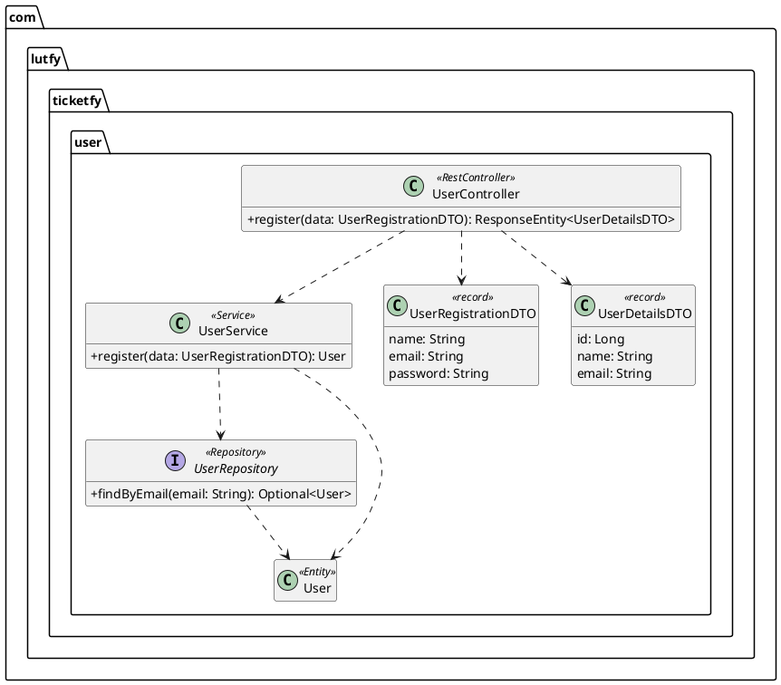
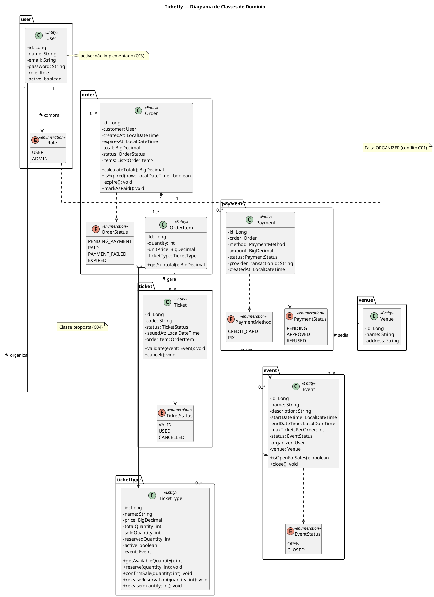

# Ticketfy 04 - Diagrama de Classes de Domínio

Oct 7, 2026 · @Rodrigo

## Fonte da modelagem

O código-fonte completo não foi analisado diretamente. A modelagem combina o que já está implementado no repositório (domínio `user`) com a estrutura planejada de pacotes e os requisitos do projeto. Cada classe e atributo indica sua origem.

| Origem | Significado | Classes |
| --- | --- | --- |
| Implementada | Existe no código do repositório. | `User`, `Role` |
| Planejada | O pacote está previsto na estrutura do projeto; os atributos vêm dos requisitos e regras de negócio. | `Venue`, `Event`, `TicketType`, `Order`, `Payment`, `Ticket` |
| Proposta | Não há pacote próprio; a classe é necessária para atender requisitos já aprovados e precisa ser confirmada. | `OrderItem` e os enums de status |

**O que já está implementado no domínio `user`**

- `Role` (enum) com os valores `USER` e `ADMIN`.
- `User` (entidade JPA, tabela `users`) com `id`, `role`, `name`, `email` e `password`. A senha chega ao construtor já criptografada com BCrypt, e o `role` é definido pelo service, nunca pelo cliente da API.
- `UserRepository`, `UserService`, `UserController`, `UserRegistrationDTO` e `UserDetailsDTO`.

**Convenções**

- Nomes de classes e atributos em inglês, como no código do projeto.
- O tipo do `id` não foi confirmado (`Long` ou `UUID`) e aparece como `Long` neste documento; ver conflito C08.
- Valores monetários usam `BigDecimal`, e datas usam `LocalDateTime`.

## Camadas: o que entra no diagrama de domínio

O diagrama de classes de domínio mostra apenas entidades e enums, porque são eles que representam os conceitos do negócio e o que é persistido no banco. As demais camadas descrevem como a aplicação processa esses conceitos e ficam em diagramas separados.

| Estrutura | Papel na arquitetura | Aparece no diagrama de domínio? | Onde representar |
| --- | --- | --- | --- |
| Entidades (`@Entity`) | Conceitos do negócio persistidos no banco, com seus atributos, regras internas e relacionamentos. | Sim | Diagrama de classes de domínio |
| Enums | Conjuntos fechados de valores usados pelas entidades, como perfis e status. | Sim, com estereótipo «enumeration» | Diagrama de classes de domínio |
| DTOs (records) | Contratos de entrada e saída da API. Evitam expor campos como `password` e impedem que o cliente defina campos como `role`. | Não | Diagrama de classes por módulo ou documentação da API (OpenAPI) |
| Services | Lógica de negócio que envolve mais de uma entidade e o controle de transações. | Não | Diagrama de classes por módulo ou diagrama de sequência |
| Repositories | Acesso aos dados via Spring Data JPA. | Não | Diagrama de classes por módulo |
| Controllers | Exposição dos endpoints REST. | Não | Diagrama de classes por módulo ou de componentes |

### Exemplo real: módulo `user` em camadas

O módulo `user` já implementado mostra como as camadas se relacionam por dependência. Este diagrama é separado do diagrama de domínio.

As setas tracejadas são dependências: cada camada usa a seguinte, mas não guarda referência de negócio a ela. A assinatura exata dos métodos deve ser conferida no código.

## 1 e 2. Classes e responsabilidades

O domínio tem 8 entidades e 6 enums. "Organizador", "Participante" e "Validação" não viraram classes próprias; a justificativa está logo abaixo da tabela.

| Classe | Tipo | Origem | Pacote | Responsabilidade |
| --- | --- | --- | --- | --- |
| `User` | Entidade | Implementada | `user` | Representar qualquer pessoa com conta: cliente, organizador ou administrador. Guarda credenciais e perfil de acesso. |
| `Role` | Enum | Implementada (incompleto) | `user` | Definir o perfil de acesso do usuário. |
| `Venue` | Entidade | Planejada | `venue` | Representar o local onde os eventos acontecem (RF05). |
| `Event` | Entidade | Planejada | `event` | Representar um evento, seu período, seu organizador, seu local e o limite de ingressos por pedido, e controlar se está aberto para vendas (RF06, RF07, RN09, RN13). |
| `EventStatus` | Enum | Proposta | `event` | Indicar se o evento está aberto ou encerrado para vendas. |
| `TicketType` | Entidade | Planejada | `tickettype` | Representar uma categoria de ingresso de um evento, com preço e estoque, e controlar reservas e disponibilidade (RF09, RF10, RN10 a RN12). |
| `Order` | Entidade | Planejada | `order` | Representar a compra de um cliente, consolidar o valor total e controlar o prazo de 15 minutos da reserva (RF11, RN12). |
| `OrderItem` | Entidade | Proposta | `order` | Registrar quantos ingressos de cada tipo foram comprados e o preço unitário no momento da compra (RN14). |
| `OrderStatus` | Enum | Proposta | `order` | Indicar a situação do pedido: aguardando pagamento, pago, pagamento recusado ou expirado. |
| `Payment` | Entidade | Planejada | `payment` | Registrar cada tentativa de pagamento de um pedido, o meio usado e o resultado informado pelo provedor (RF12, RN15). |
| `PaymentMethod` | Enum | Proposta | `payment` | Indicar o meio de pagamento: cartão de crédito ou Pix (RF12). |
| `PaymentStatus` | Enum | Proposta | `payment` | Indicar o resultado do pagamento. |
| `Ticket` | Entidade | Planejada | `ticket` | Representar o ingresso individual emitido após o pagamento, com código único, e controlar cancelamento e validação (RF13, RF15, RF16). |
| `TicketStatus` | Enum | Proposta | `ticket` | Indicar se o ingresso está válido, utilizado ou cancelado (RF14). |

**Conceitos que não viraram classes**

- **Organizador:** é um `User` com perfil de organizador. Não há atributos exclusivos de organizador nos requisitos, então uma subclasse não se justifica (ver seção 4 a 6, Herança).
- **Participante:** é o cliente dono de um ingresso válido de um evento. A lista de participantes (RF17) é uma consulta sobre `Ticket`, `OrderItem` e `Order`, não uma entidade.
- **Validação:** é uma operação sobre o ingresso (`Ticket.validate`), que muda seu status para utilizado (RN21). Não há dados próprios que exijam uma classe.

## 3. Atributos e métodos

Apenas os atributos de `User` foram confirmados no código. Os demais seguem o mínimo exigido pelos requisitos; cada um indica a regra ou o requisito que o justifica. Os relacionamentos aparecem como atributos de referência (por exemplo, `organizer: User`), como ficam nas entidades JPA.

### Atributos

| Classe | Atributo | Tipo | Origem |
| --- | --- | --- | --- |
| `User` | `id` | `Long` | Implementado (tipo a confirmar) |
| `User` | `name` | `String` | Implementado |
| `User` | `email` | `String` | Implementado; único (RN01) |
| `User` | `password` | `String` | Implementado; hash BCrypt (RNF01) |
| `User` | `role` | `Role` | Implementado (RN02) |
| `User` | `active` | `boolean` | Não implementado; exigido por RN03 e RNF15 (conflito C03) |
| `Venue` | `id`, `name`, `address` | `Long`, `String`, `String` | Premissa: mínimo para identificar um local (RF05) |
| `Event` | `id`, `name`, `description` | `Long`, `String`, `String` | RF06 |
| `Event` | `startDateTime`, `endDateTime` | `LocalDateTime` | RF06, RN07 |
| `Event` | `maxTicketsPerOrder` | `int` | RF06, RN13: limite definido pelo organizador |
| `Event` | `status` | `EventStatus` | RF07, RN09 |
| `Event` | `organizer` | `User` | RN04, RN08 |
| `Event` | `venue` | `Venue` | RN08 |
| `TicketType` | `id`, `name` | `Long`, `String` | RF09 |
| `TicketType` | `price` | `BigDecimal` | RF09, RN10 |
| `TicketType` | `totalQuantity`, `soldQuantity`, `reservedQuantity` | `int` | RN11, RN12 |
| `TicketType` | `active` | `boolean` | RF09 (desativar tipo de ingresso) |
| `TicketType` | `event` | `Event` | RN10 |
| `Order` | `id` | `Long` | RF11 |
| `Order` | `customer` | `User` | RF11, RN05 |
| `Order` | `createdAt` | `LocalDateTime` | RF11 |
| `Order` | `expiresAt` | `LocalDateTime` | RN12: fim da reserva, 15 minutos após a criação |
| `Order` | `total` | `BigDecimal` | RN15 |
| `Order` | `status` | `OrderStatus` | RN12, RN16 |
| `Order` | `items` | `List<OrderItem>` | RF11 |
| `OrderItem` | `id`, `quantity` | `Long`, `int` | RF11, RN13 |
| `OrderItem` | `unitPrice` | `BigDecimal` | RN14 |
| `OrderItem` | `ticketType` | `TicketType` | RF11 |
| `Payment` | `id` | `Long` | RF12 |
| `Payment` | `method` | `PaymentMethod` | RF12: cartão de crédito ou Pix |
| `Payment` | `amount` | `BigDecimal` | RN15 |
| `Payment` | `status` | `PaymentStatus` | RF12 |
| `Payment` | `providerTransactionId` | `String` | Identifica a transação no provedor de pagamento real (Q01) |
| `Payment` | `createdAt` | `LocalDateTime` | RF12 |
| `Payment` | `order` | `Order` | RN15 |
| `Ticket` | `id` | `Long` | RF13 |
| `Ticket` | `code` | `String` | RN17; o formato depende de Q04 |
| `Ticket` | `status` | `TicketStatus` | RF14, RN18, RN21 |
| `Ticket` | `issuedAt` | `LocalDateTime` | RF13 |
| `Ticket` | `orderItem` | `OrderItem` | RF13 |

### Enums

| Enum | Valores | Origem |
| --- | --- | --- |
| `Role` | `USER`, `ADMIN` | Implementado. Falta `ORGANIZER` para atender os três perfis dos requisitos (conflito C01). |
| `EventStatus` | `OPEN`, `CLOSED` | RF07, RN09. Um valor `CANCELLED` depende de Q07. |
| `OrderStatus` | `PENDING_PAYMENT`, `PAID`, `PAYMENT_FAILED`, `EXPIRED` | RN12, RN16 |
| `PaymentMethod` | `CREDIT_CARD`, `PIX` | RF12 |
| `PaymentStatus` | `PENDING`, `APPROVED`, `REFUSED` | RF12 |
| `TicketStatus` | `VALID`, `USED`, `CANCELLED` | RF14 |

### Métodos de domínio

São listados apenas métodos que protegem uma regra de negócio dentro da própria entidade. Getters, setters e construtores foram omitidos.

| Classe | Método | Regra que protege |
| --- | --- | --- |
| `Event` | `isOpenForSales(): boolean` | RN09 |
| `Event` | `close(): void` | RF07 |
| `TicketType` | `getAvailableQuantity(): int` | RN12: total − vendidos − reservados |
| `TicketType` | `reserve(quantity: int): void` | RN12, RN13: recusa reserva acima do disponível |
| `TicketType` | `confirmSale(quantity: int): void` | RN16: converte a reserva em venda após o pagamento |
| `TicketType` | `releaseReservation(quantity: int): void` | RN12: devolve unidades de reserva expirada |
| `TicketType` | `release(quantity: int): void` | RN18: devolve unidades de ingresso cancelado |
| `Order` | `calculateTotal(): BigDecimal` | RN15 |
| `Order` | `isExpired(now: LocalDateTime): boolean` | RN12 |
| `Order` | `expire(): void` | RN12 |
| `Order` | `markAsPaid(): void` | RN16 |
| `OrderItem` | `getSubtotal(): BigDecimal` | RN14 |
| `Ticket` | `validate(event: Event): void` | RN21, RN22: aceita apenas ingresso válido do próprio evento |
| `Ticket` | `cancel(): void` | RN18, RN19: recusa ingresso já utilizado |

## 4 a 6. Relacionamentos, cardinalidades e herança

O modelo tem 6 associações, 2 composições e 1 dependência. Não há agregação nem herança; os motivos estão ao final da seção.

| Origem | Cardinalidade | Tipo | Cardinalidade | Destino | Significado |
| --- | --- | --- | --- | --- | --- |
| `User` (organizador) | 1 | Associação "organiza" | 0..\* | `Event` | Um organizador pode ter nenhum ou vários eventos; todo evento tem exatamente um organizador (RN08). |
| `Venue` | 1 | Associação "sedia" | 0..\* | `Event` | Um local pode sediar vários eventos, ou nenhum ainda; todo evento ocorre em exatamente um local (RN08). |
| `Event` | 1 | Composição | 0..\* | `TicketType` | Os tipos de ingresso são partes do evento e não existem sem ele (RN10). Um evento recém-cadastrado pode ainda não ter tipos. |
| `User` (cliente) | 1 | Associação "compra" | 0..\* | `Order` | Um cliente pode ter nenhum ou vários pedidos; cada pedido pertence a um único cliente (RN05). |
| `Order` | 1 | Composição | 1..\* | `OrderItem` | Um pedido tem pelo menos um item, e os itens não existem fora do pedido. |
| `OrderItem` | 0..\* | Associação | 1 | `TicketType` | Cada item se refere a um tipo de ingresso; um tipo pode aparecer em vários itens de pedidos diferentes. |
| `Order` | 1 | Associação | 0..\* | `Payment` | Cada pagamento pertence a um único pedido (RN15). A cardinalidade 0..\* permite registrar tentativas recusadas (RF12); ver conflito C06. |
| `OrderItem` | 1 | Associação "gera" | 0..\* | `Ticket` | Um item com quantidade N gera N ingressos após o pagamento; antes disso, gera zero (RN16). |
| `Ticket` | — | Dependência «use» | — | `Event` | `Ticket.validate(event)` recebe o evento da portaria para conferir se o ingresso pertence a ele (RN22), sem guardar referência permanente. |

### Como ler uma cardinalidade

Tomando a linha `User 1 ─── 0..* Order`: lendo da esquerda para a direita, um usuário está associado a zero ou mais pedidos. Lendo da direita para a esquerda, um pedido está associado a exatamente um usuário. No banco, isso vira uma chave estrangeira `customer_id` obrigatória na tabela de pedidos; no Java, um `@ManyToOne` em `Order` e, opcionalmente, um `@OneToMany` em `User`.

### Por que não há agregação

Agregação indica uma relação todo-parte em que a parte vive independentemente do todo. O candidato mais próximo seria `Venue`–`Event`, mas um evento não é "parte" de um local: os dois apenas se relacionam. Por isso foi usada associação simples, que é a leitura mais precisa.

### Por que não há herança

Uma alternativa seria `Customer`, `Organizer` e `Admin` herdando de `User`. Ela foi descartada por três motivos:

1. O código implementado já representa perfis com o enum `Role`, e não com subclasses.
2. Os requisitos não definem atributos exclusivos de nenhum perfil; as diferenças estão apenas nas permissões (RF03), que o Spring Security trata pelo `role`.
3. Herança em JPA exige uma estratégia de mapeamento (`SINGLE_TABLE`, `JOINED` ou `TABLE_PER_CLASS`), o que adiciona complexidade sem ganho para este domínio.

Se no futuro o organizador precisar de dados próprios, como CNPJ ou dados bancários, a opção recomendada é uma entidade `OrganizerProfile` associada 1 para 0..1 a `User`, mantendo o enum de perfis.

## 7. Diagrama UML

O desenho abaixo mostra as entidades e seus relacionamentos; os enums, atributos e métodos estão no código PlantUML logo em seguida.

&#91;embedded content: domínio do Ticketfy · 8 entidades, 6 associações, 2 composições, 1 dependência\]

O catálogo (`Venue`, `Event`, `TicketType`) fica na parte superior e central; as vendas (`Order`, `OrderItem`, `Payment`, `Ticket`) ficam na parte inferior e à direita, ligadas ao catálogo por `OrderItem → TicketType`.

### Código PlantUML

Para renderizar, cole o código em [plantuml.com](https://www.plantuml.com/plantuml) ou use a extensão PlantUML do IntelliJ ou do VS Code.

No PlantUML, `*--` é composição (losango no lado do todo), `--` é associação, `-->` é associação navegável e `..>` é dependência. As setas tracejadas para os enums indicam que a entidade usa o enum como tipo de atributo.

## 8. Explicação do diagrama

O modelo se divide em dois blocos ligados pelo `TicketType`: o **catálogo** (`Venue`, `Event`, `TicketType`), mantido pelo organizador, e as **vendas** (`Order`, `OrderItem`, `Payment`, `Ticket`), geradas pelo cliente. O `User` participa dos dois blocos em papéis diferentes, definidos pelo `Role`.

**Fluxo representado no modelo**

1. O organizador (`User` com perfil de organizador) cadastra um `Event` em um `Venue` e define seus `TicketType`.
2. O cliente cria um `Order` com um ou mais `OrderItem`. Cada item aponta para um `TicketType` e guarda o preço unitário daquele momento (RN14). `TicketType.`reserve() reserva as unidades por 15 minutos e impede reservar acima do disponível (RN12); o limite por pedido do evento também é verificado (RN13).
3. O pedido recebe um ou mais `Payment`, cada um com o identificador da transação no provedor. Quando um pagamento é aprovado, `Order.markAsPaid()` muda o status do pedido e TicketType.confirmSale() converte a reserva em venda. Se os 15 minutos passarem sem aprovação, Order.expire() e TicketType.releaseReservation() devolvem as unidades.
4. Com o pedido pago, cada `OrderItem` gera tantos `Ticket` quanto sua quantidade, cada um com código único (RN16, RN17).
5. Na entrada, o organizador valida o ingresso com `Ticket.validate(event)`, que confere o evento e muda o status para `USED` (RN21, RN22). Um cancelamento chama `Ticket.cancel()` e `TicketType.release()` (RN18, RN19).

**Decisões de modelagem**

- **`Ticket` ligado a `OrderItem`, e não diretamente a `TicketType`:** o tipo, o evento e o cliente do ingresso são alcançados pelo item e pelo pedido, sem duplicar dados que poderiam ficar inconsistentes.
- **Regras dentro das entidades:** métodos como `sell()`, `validate()` e `cancel()` mantêm as regras junto aos dados que elas protegem. Os services coordenam transações e repositórios, mas não duplicam essas verificações.
- **Controle de concorrência:** `reserve()` garante a regra dentro de um objeto, mas não impede duas transações simultâneas de vender a última unidade. Isso deve ser resolvido na persistência, com lock pessimista ou um campo `@Version` em `TicketType` (RNF07). O campo não aparece no diagrama por ser um detalhe técnico, não de negócio.

## Conflitos identificados

Foram encontrados 8 conflitos entre código, requisitos e casos de uso. C01 e C02 são os mais importantes, porque afetam quem pode fazer o quê no sistema.

| ID | Conflito | Elementos envolvidos | Decisão necessária |
| --- | --- | --- | --- |
| C01 | O enum `Role` implementado tem `USER` e `ADMIN`, mas os requisitos definem três perfis: cliente, organizador e administrador. | Código, RN02, Documento de Visão | Adicionar `ORGANIZER` ao enum e decidir se `USER` passa a significar cliente ou se é renomeado para `CUSTOMER`. |
| C02 | O README do repositório diz que administradores cadastram locais, eventos e tipos de ingresso; os requisitos atribuem isso ao organizador. | README, RF06, RF09, RN04 | Definir quem cadastra eventos e atualizar o documento que estiver desatualizado. |
| C03 | `User` não tem campo de ativação, mas RN03 e RNF15 exigem desativação lógica. | Código, RN03, RNF15 | Adicionar `active` (ou equivalente) a `User` e criar a migration correspondente. |
| C04 | `OrderItem` não está entre os pacotes planejados, mas é necessário para registrar vários tipos de ingresso por pedido com preço congelado. | Estrutura de pacotes, RF11, RN14 | Confirmar a classe no pacote `order`. |
| C05 | O documento do UC01 usa entidades e atributos não confirmados: `Attendee`, `AuditLog`, `reservedQuantity`, `serviceFee`, `expiresAt` e CPF do participante. | UC01, Documento de Requisitos | Resolvido: reservedQuantity e expiresAt foram confirmados pela reserva de 15 minutos e entraram no modelo; Attendee, AuditLog, serviceFee e CPF foram removidos do UC01. |
| C06 | Não está definido se um pedido pode ter mais de uma tentativa de pagamento. | RF12, RN15 | Confirmar a cardinalidade `Order 1 ── 0..* Payment` ou trocar por `0..1`. |
| C07 | O tratamento de evento cancelado com ingressos vendidos está em aberto. | RF07, Q07 | Definir se `EventStatus` terá `CANCELLED` e o que acontece com os ingressos. |
| C08 | O tipo do identificador não foi confirmado: o UC01 assume `UUID`, e este documento usa `Long`. | Migration `V1__create_table_users.sql`, UC01 | Conferir a migration e padronizar o tipo em todas as entidades. |
