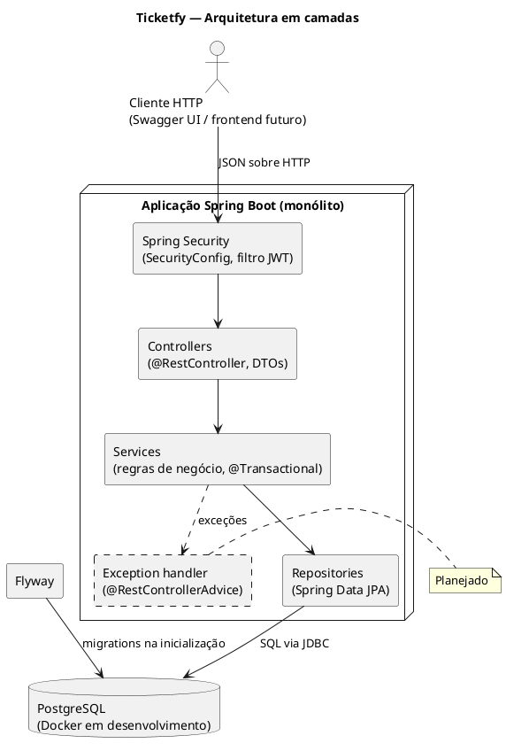
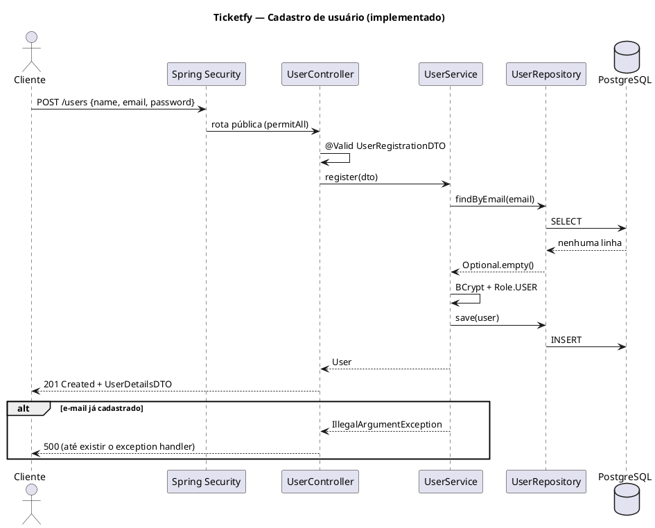
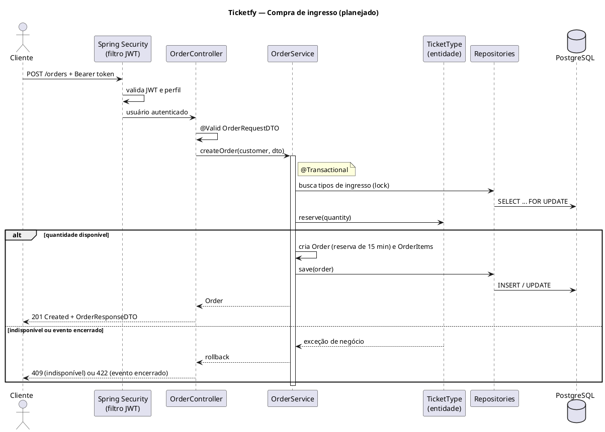

# Ticketfy 05 - Documento de Arquitetura

Oct 7, 2026 · @Rodrigo

## Base desta documentação

Esta documentação descreve a arquitetura com base no repositório do Ticketfy e no histórico de desenvolvimento do projeto. O código-fonte não foi anexado a esta análise; por isso, cada componente indica se está implementado, em andamento ou planejado. O último estado conhecido é: domínio `user` implementado, autenticação por JWT em andamento e demais domínios planejados.

### Tecnologias do projeto

| Tecnologia | Uso | Situação |
| --- | --- | --- |
| Java 17 | Linguagem do backend | Em uso |
| Spring Boot 4 | Framework da aplicação | Em uso |
| Spring Web | Exposição da API REST | Em uso |
| Spring Data JPA / Hibernate | Mapeamento objeto-relacional e repositórios | Em uso |
| PostgreSQL | Banco de dados relacional | Em uso |
| Flyway | Versionamento do esquema do banco | Em uso (`V1__create_table_users.sql`) |
| Spring Security | Autenticação e autorização | Em uso (configuração inicial) |
| BCrypt | Hash de senhas | Em uso |
| java-jwt (Auth0) | Geração e validação de tokens JWT | Dependência adicionada; emissão do token em andamento |
| Bean Validation (Jakarta) | Validação dos dados de entrada | Em uso |
| Springdoc OpenAPI / Swagger UI | Documentação interativa da API | Configurado |
| Lombok | Redução de código repetitivo (`@Getter`, `@Setter`, construtores) | Em uso |
| Maven | Build e dependências | Em uso |
| Docker Compose | Execução do PostgreSQL no ambiente de desenvolvimento | Em uso (apenas o banco) |

O pagamento será processado por um provedor real, ainda não escolhido, com cartão de crédito e Pix. Por isso, nenhum serviço externo aparece nos diagramas como componente existente.

## 1. Visão geral da arquitetura

O Ticketfy é uma aplicação monolítica em camadas, exposta como API REST e organizada em pacotes por domínio. Todo o backend roda em um único processo Spring Boot conectado a um único banco PostgreSQL.

A arquitetura combina três ideias:

- **Camadas:** cada requisição atravessa controller, service e repository, nessa ordem. Cada camada tem uma responsabilidade e só conversa com a camada imediatamente abaixo.
- **Pacotes por domínio:** em vez de agrupar todos os controllers em um pacote e todos os services em outro, cada domínio (`user`, `event`, `order` e assim por diante) reúne suas próprias classes de todas as camadas. O que muda junto fica junto.
- **REST stateless:** o servidor não guarda sessão. Cada requisição carrega o necessário para ser autenticada, o que deixa o backend independente do frontend que vier a consumi-lo.

### Princípios aplicados

| Princípio | Como aparece no Ticketfy |
| --- | --- |
| Separação de responsabilidades | O controller trata HTTP, o service aplica regras de negócio e o repository acessa o banco. No cadastro de usuário, por exemplo, quem decide o perfil e criptografa a senha é o `UserService`, e não o controller. |
| Injeção de dependência | O Spring cria e injeta as dependências pelo construtor: o `UserController` recebe o `UserService`, que recebe o `UserRepository` e o `PasswordEncoder`. Nenhuma classe instancia suas dependências com `new`. |
| Baixo acoplamento | Os controllers dependem de services, e não do banco. A API expõe DTOs, e não entidades, então mudanças no banco não quebram o contrato com o cliente. |
| Alta coesão | Cada pacote de domínio contém apenas o que diz respeito àquele conceito do negócio. |

### Por que essa arquitetura

O Ticketfy tem um único time, um único banco e um escopo acadêmico. Uma arquitetura em camadas dentro de um monólito atende esse cenário com pouca infraestrutura, transações locais no banco e um padrão amplamente documentado no ecossistema Spring. A organização por domínio prepara o projeto para crescer sem que os pacotes técnicos se tornem grandes demais.

## 2. Camadas do sistema

A requisição desce pelas camadas e a resposta sobe pelo mesmo caminho. Os pacotes `security` e `exception` atuam antes e depois desse caminho, para todos os domínios.

### Controller

Recebe as requisições HTTP, aciona a validação dos dados de entrada com `@Valid` e delega o trabalho ao service. Converte o resultado em `ResponseEntity`, com o status HTTP adequado. Não contém regra de negócio nem acessa o banco.

*No projeto:* `UserController` expõe `POST /users` para o cadastro público.

### Service

Concentra a lógica de negócio e coordena entidades e repositórios. É a camada onde ficam as transações (`@Transactional`), porque um caso de uso, como reservar estoque e criar um pedido, precisa ser gravado por inteiro ou não ser gravado.

*No projeto:* `UserService.register()` verifica se o e-mail já existe, criptografa a senha com BCrypt, define o perfil `USER` e salva o usuário.

### Repository

Interfaces do Spring Data JPA que fazem o acesso ao banco. As operações básicas (salvar, buscar por id, listar) vêm prontas de `JpaRepository`, e consultas específicas são declaradas pelo nome do método.

*No projeto:* `UserRepository.findByEmail(String email)` retorna `Optional<User>`.

### Entity (domínio)

Classes anotadas com `@Entity` que representam os conceitos do negócio e são mapeadas para tabelas. Usam `@Getter` e `@Setter` do Lombok em vez de `@Data`, para evitar problemas de `equals`, `hashCode` e `toString` com os proxies do JPA.

*No projeto:* `User` (tabela `users`) e o enum `Role`. O modelo completo está no documento de Diagrama de Classes.

### DTO

Records que definem o formato de entrada e saída da API. Separam o contrato público da estrutura interna e impedem dois problemas comuns: vazar campos sensíveis e permitir que o cliente preencha campos que não deveria.

*No projeto:* `UserRegistrationDTO` (entrada: nome, e-mail e senha, com validações) não tem o campo `role`, para que ninguém se cadastre como administrador. `UserDetailsDTO` (saída: id, nome e e-mail) não tem o campo `password`.

### Exception

Tratamento centralizado de erros com `@RestControllerAdvice`, convertendo exceções em respostas HTTP padronizadas.

*No projeto:* **implementado.** Toda resposta de erro segue a RFC 7807 (`ProblemDetail` do Spring), com `Content-Type: application/problem+json` e os campos:

| Campo | Conteúdo |
| --- | --- |
| `type` | URI estável do tipo de erro: `https://ticketfy-api.onrender.com/problems/<slug>` (propriedade `ticketfy.problems.base-uri`). |
| `title` | Resumo fixo do tipo de erro. |
| `status` | Código HTTP. |
| `detail` | Mensagem legível para o cliente, específica da ocorrência. |
| `instance` | Caminho da requisição que falhou. |

Erros de Bean Validation trazem também `errors`, com um item `{ field, message }` por campo inválido:

```json
{
  "type": "https://ticketfy-api.onrender.com/problems/validation-failed",
  "title": "Validation failed",
  "status": 400,
  "detail": "Validation failed",
  "instance": "/users",
  "errors": [
    { "field": "password", "message": "Password must be at least 8 characters long" }
  ]
}
```

Quem gera cada resposta:

- `GlobalExceptionHandler` (`@RestControllerAdvice`): exceções de negócio e do Spring MVC. O enum `ProblemType` concentra slug, título e status de cada tipo, e o `ProblemDetailFactory` monta a resposta.
- `JsonAuthenticationEntryPoint`: 401 `authentication-required` quando a rota exige token e ele falta ou é inválido.
- `JsonAccessDeniedHandler`: 403 `access-denied` negado pelo Spring Security. O 403 de `@PreAuthorize` também usa `access-denied`, só que pelo handler global.
- `LoginRateLimitFilter`: 429 `too-many-login-attempts`, com o cabeçalho `Retry-After`.
- `AuthOriginFilter`: 403 `auth-request-rejected` quando um `POST /auth/**` chega sem `Origin` permitido ou sem o header `X-Ticketfy-Auth: 1`.
- `AuthController`: 401 `session-expired` quando `POST /auth/refresh` recebe um refresh token ausente, vencido, revogado ou já usado; a resposta também apaga o cookie.
- `ProblemDetailErrorController`: substitui o `/error` do Spring Boot. Erros que escapam do MVC (por exemplo, exceção num filtro) viram um problem genérico por status, sem mensagem interna.

| Status | Tipos (`slug`) |
| --- | --- |
| 400 | `validation-failed`, `malformed-request-body`, `missing-parameter`, `missing-header`, `invalid-parameter`, `invalid-event-dates`, `invalid-ticket-type-quantity`, `mixed-events-order`, `max-per-order-exceeded`, `self-transfer`, `bad-request` |
| 401 | `invalid-credentials`, `authentication-required`, `session-expired` |
| 403 | `access-denied`, `event-access-denied`, `auth-request-rejected` |
| 404 | `user-not-found`, `event-not-found`, `ticket-type-not-found`, `order-not-found`, `ticket-not-found`, `resource-not-found` |
| 405 | `method-not-allowed` (com o cabeçalho `Allow`) |
| 409 | `email-already-exists`, `invalid-role-change`, `ticket-type-name-already-exists`, `invalid-order-state`, `insufficient-stock`, `invalid-payment-state`, `invalid-ticket-state`, `invalid-event-state`, `event-has-sales`, `ticket-transfer-closed`, `ticket-transfer-limit-reached`, `order-has-transferred-tickets` |
| 415 | `unsupported-media-type` |
| 422 | `transfer-recipient-unavailable` |
| 429 | `too-many-login-attempts`, `too-many-transfer-attempts` |
| 500 | `internal-error` |

O 500 genérico responde sempre `detail: "Internal server error"`. A exceção vai apenas para o log, e a resposta nunca expõe mensagem, stack trace ou nome de classe. Um status de erro sem tipo próprio que chegue ao `/error` responde com `type: about:blank` e o nome padrão do status.

### Security

Autenticação e autorização com Spring Security. Intercepta a requisição antes do controller e decide se ela pode seguir.

*No projeto:* **parcialmente implementado.** O `SecurityConfig` já define sessão stateless, rotas públicas e o `PasswordEncoder`. O login com emissão de JWT e o filtro que valida o token estão em andamento (detalhes na seção 5).

### Config

Classes de configuração transversais, como os beans do Spring (`ClockConfig`, `SchedulingConfig`). O `SecurityConfig` fica no pacote `infra/config`, e as classes de autenticação (login, tokens e filtros) ficam no pacote `infra/security`. O Springdoc é configurado apenas por propriedades.

## 3. Diagrama de arquitetura

Todas as requisições passam pelo Spring Security antes de chegar a um controller, e a regra de negócio fica concentrada na camada de services.

&#91;embedded content: arquitetura do Ticketfy · 4 camadas, 1 banco, componente planejado tracejado\]

O Flyway não participa das requisições: ele aplica as migrations uma vez, quando a aplicação inicia. O Exception handler aparece tracejado porque ainda será implementado. O provedor de pagamento não aparece porque ainda não foi escolhido.

### PlantUML



## 4. Fluxo de uma requisição

São mostrados dois fluxos: o cadastro de usuário, que já está implementado, e a compra de ingresso, que é planejada. O primeiro descreve o sistema como ele é; o segundo, como ele deverá funcionar seguindo a mesma arquitetura.

### 4.1 Cadastro de usuário (implementado)

&#91;embedded content: sequência do cadastro de usuário · fluxo implementado\]

Linhas cheias são chamadas; linhas tracejadas são retornos.

| Etapa | Componente | O que acontece |
| --- | --- | --- |
| 1 | Cliente | Envia `POST /users` com nome, e-mail e senha em JSON. |
| 2 | Spring Security | Confere que `/users` é rota pública e deixa a requisição seguir sem token. |
| 3 | `UserController` | Converte o JSON em `UserRegistrationDTO` e valida com `@Valid`. Dados inválidos são recusados com 400 antes de chegar ao service. |
| 4 | `UserService` | Consulta `findByEmail` para garantir que o e-mail ainda não existe (RN01). |
| 5 | `UserService` | Criptografa a senha com BCrypt e define o perfil `USER`. |
| 6 | `UserRepository` | Salva o usuário; o Hibernate gera o `INSERT` na tabela `users`. |
| 7 | `UserController` | Converte o usuário salvo em `UserDetailsDTO`, sem a senha, e responde 201. |

Se o e-mail já existir, o service lança `EmailAlreadyExistsException`, que o `GlobalExceptionHandler` converte em 409 no formato RFC 7807 (`type` terminado em `email-already-exists`). Dados inválidos respondem 400 `validation-failed`, com a lista `errors` por campo (veja a seção Exception).



### 4.2 Compra de ingresso (planejado)

O recurso REST da compra é o pedido, então o endpoint planejado é `POST /orders`, e não `POST /ingressos/compra`: em REST, a URL nomeia o recurso criado e o verbo HTTP indica a ação. O fluxo abaixo cobre a criação do pedido; o pagamento é uma etapa seguinte, que depende do provedor ainda não escolhido.

| Etapa | Componente | O que acontece |
| --- | --- | --- |
| 1 | Cliente | Envia `POST /orders` com o token JWT e a lista de tipos de ingresso e quantidades. |
| 2 | Spring Security | O filtro valida o token e identifica o usuário. Sem token válido, responde 401; com perfil diferente de cliente, 403. |
| 3 | `OrderController` | Valida o DTO de entrada com `@Valid` e chama o service com o usuário autenticado. |
| 4 | `OrderService` | Abre a transação (`@Transactional`) e busca os tipos de ingresso com bloqueio para escrita, evitando venda simultânea da mesma unidade. |
| 5 | Entidades | `Event.isOpenForSales()` confere se o evento aceita vendas (RN09); a quantidade é comparada ao limite por pedido do evento (RN13); `TicketType.reserve()` reserva as unidades e recusa quantidade acima do disponível (RN12). |
| 6 | `OrderService` | Cria o `Order` com seus `OrderItem`, registrando o preço unitário do momento (RN14), calcula o total e define o fim da reserva para 15 minutos depois (RN12). |
| 7 | Repositories | Gravam o pedido, os itens e a nova quantidade reservada na mesma transação. Qualquer falha desfaz tudo. |
| 8 | `OrderController` | Responde 201 com o DTO do pedido, em situação "aguardando pagamento". |

Depois de criado o pedido, o cliente paga com cartão de crédito ou Pix pelo provedor de pagamento, ainda a escolher. Quando o provedor confirma o pagamento, a reserva vira venda e os ingressos são emitidos. Pedidos não pagos em 15 minutos serão expirados por uma tarefa agendada do próprio Spring (`@Scheduled`, planejada), que devolve as unidades reservadas.



Os nomes `OrderController`, `OrderService`, `OrderRequestDTO` e `OrderResponseDTO` seguem o padrão do módulo `user` e serão confirmados na implementação. As respostas 409 e 422 dependem do exception handler planejado.

## 5. Segurança

A segurança usa Spring Security sem `HttpSession`. Senhas, validação de entrada, rotas públicas e autenticação por token com sessões revogáveis no banco estão implementadas.

| Aspecto | Mecanismo | Situação |
| --- | --- | --- |
| Senhas | Hash com BCrypt (`BCryptPasswordEncoder`, exposto como `@Bean PasswordEncoder`). A senha é criptografada no service antes de chegar à entidade e nunca é devolvida pela API. | Implementado |
| Validação de dados | Bean Validation nos DTOs: `@NotBlank`, `@Email`, `@Size(max = 150)` no e-mail e `@Size(min = 8)` na senha, ativados com `@Valid` no controller. | Implementado |
| Proteção contra elevação de perfil | O DTO de cadastro não tem `role`; o perfil é definido pelo `UserService` como `USER`. | Implementado |
| Sessão | O Spring Security segue `STATELESS` (sem `HttpSession`), mas cada login cria uma linha em `auth_sessions`, com limite absoluto de 12 h. O CSRF do Spring fica desligado, porque só as rotas `/auth/**` leem cookie, e elas têm proteção própria (linha CSRF). Ver DA14. | Implementado |
| Rotas públicas | `POST /users` (cadastro), `POST /auth/login`, `POST /auth/refresh` e `POST /auth/logout` liberadas com `permitAll()`; qualquer outra rota, inclusive `POST /auth/logout-all`, exige autenticação (`anyRequest().authenticated()`). | Implementado |
| Autenticação | `POST /auth/login` recebe e-mail e senha, o `AuthenticationManager` confere as credenciais e o `AuthSessionService` cria a sessão. A resposta traz um access token JWT de 10 min (java-jwt, HS256, `sub` = id do usuário, `sid` = id da sessão) e grava o refresh token no cookie `__Host-ticketfy_rt` (`HttpOnly`, `Secure`, `SameSite=Strict`, `Path=/`). O refresh token tem 32 bytes aleatórios, vale 30 min sem uso e o banco guarda só o SHA-256 dele. `POST /auth/refresh` troca o token por um sucessor; reapresentar um token já usado revoga a sessão inteira e grava auditoria. `POST /auth/logout` encerra a sessão do cookie, `POST /auth/logout-all` encerra todas as do usuário, e `PATCH /users/me/password` confere a senha atual, encerra todas e abre uma nova. Um job diário apaga sessões vencidas ou revogadas há mais de 7 dias. | Implementado |
| Tokens | O `SecurityFilter` lê o header `Authorization: Bearer <token>`, valida o JWT e busca a sessão pelo `sid` junto com o usuário, numa única consulta. Sessão revogada ou vencida responde 401 na hora, sem esperar o JWT expirar. | Implementado |
| CSRF | O `AuthOriginFilter` roda antes do Spring Security e recusa todo `POST /auth/**` sem `Origin` idêntico a uma origem de `ticketfy.cors.allowed-origins` ou sem o header `X-Ticketfy-Auth: 1` (403 `auth-request-rejected`). A comparação exata também barra os deploys de preview. | Implementado |
| IP do cliente | O front chega às rotas de sessão por um proxy em Cloudflare Pages Functions. O `ClientAddressResolver` só aceita o IP do header `X-Client-IP` quando o header `X-Proxy-Secret` confere com `PROXY_SHARED_SECRET` (comparação em tempo constante); fora isso, usa o endereço remoto. O limite de login (`POST /auth/login`) conta tentativas por esse IP. Em produção, a aplicação não sobe sem `PROXY_SHARED_SECRET` ou com `ticketfy.auth.cookie-secure=false`. | Implementado |
| Autorização por perfil | `User` implementará `UserDetails`, expondo o `role` como autoridade. Regras por perfil, como "só organizador cria evento", serão declaradas por rota ou por método. | Planejado |
| Controle de acesso ao recurso | Verificar no service se o recurso pertence ao usuário (um cliente só vê os próprios pedidos; um organizador só edita os próprios eventos). | Planejado |

O enum `Role` tem hoje apenas `USER` e `ADMIN`. A autorização por perfil depende da inclusão do perfil de organizador, conforme o conflito C01 do Diagrama de Classes.

## 6. Observabilidade

Cada requisição recebe um identificador que acompanha todos os logs gerados por ela.

| Aspecto | Mecanismo |
| --- | --- |
| Identificador da requisição | O `RequestIdFilter` roda antes de todos os outros filtros, inclusive do Spring Security e do limite de login. Ele aceita o header `X-Request-Id` do cliente quando o valor tem só letras, números e hífen, com até 64 caracteres; caso contrário, gera um UUID. O valor vai para o MDC (`requestId`) e volta no header `X-Request-Id` de toda resposta, inclusive em erros e no 429. |
| Usuário | Depois da autenticação, o `SecurityFilter` coloca no MDC o id do usuário (`userId`), nunca o e-mail ou o nome. |
| Log de acesso | Uma linha por requisição ao terminar: método, path sem query string, status e duração em ms. `/actuator/health` não gera essa linha. |
| Rotinas agendadas | A expiração de pedidos e o reprocessamento de cancelamentos colocam um `runId` próprio no MDC a cada execução. |
| Formato | No perfil `prod`, os logs saem em JSON no formato ECS (`logging.structured.format.console=ecs`), com `requestId`, `userId` e `runId` como campos. No perfil `dev`, mantêm o formato legível, com o identificador entre colchetes. |
| Erros 5xx | O ProblemDetail inclui a propriedade `requestId`, igual ao header, para o usuário informar o código ao suporte. O CORS expõe `X-Request-Id` para o front conseguir lê-lo. |
| Dados sensíveis | Não se registram o header `Authorization`, tokens, senhas nem corpos de requisição ou de resposta. |

## 7. Persistência

Os dados ficam em um único banco PostgreSQL, acessado pelo Spring Data JPA com Hibernate. O esquema é criado e alterado exclusivamente por migrations Flyway.

### Banco de dados

No desenvolvimento, o PostgreSQL roda em um contêiner definido no `docker-compose.yml`. As credenciais de conexão são lidas de variáveis de ambiente (`DB_URL`, `DB_USERNAME`, `DB_PASSWORD`), e não ficam gravadas no repositório.

### ORM e JPA

As entidades são mapeadas com anotações JPA (`@Entity`, `@Table`, `@Id`, `@Enumerated(EnumType.STRING)`). O enum é gravado como texto, e não como número, para que reordenar os valores no Java não corrompa os dados existentes. Cada entidade tem um construtor sem argumentos (`@NoArgsConstructor`), exigido pelo JPA.

### Migrations

O Flyway executa as migrations na inicialização da aplicação, em ordem de versão. Hoje existe `V1__create_table_users.sql`, que cria a tabela `users` com e-mail único. Cada novo domínio ganha suas migrations (`V2__...`, `V3__...`), e uma migration já aplicada nunca é editada: correções entram em uma nova versão.

### Repositories

Cada entidade tem uma interface que estende `JpaRepository`. O Spring gera a implementação em tempo de execução, inclusive para consultas derivadas do nome do método, como `findByEmail`.

### Relacionamentos entre entidades

Os relacionamentos planejados são detalhados no Diagrama de Classes de Domínio. No mapeamento JPA, eles seguem três orientações:

- `@ManyToOne` com carregamento `LAZY` no lado "muitos" (por exemplo, `Order` → `User`), que vira uma chave estrangeira.
- Composições, como `Order` e seus itens, com `@OneToMany(mappedBy = ..., cascade = ALL, orphanRemoval = true)`, para que os itens sejam salvos e removidos junto com o pedido.
- Entidades nunca são serializadas diretamente na resposta: a conversão para DTO acontece dentro da transação, evitando erros de carregamento preguiçoso fora dela.

## 8. Organização do projeto

O projeto segue a organização por domínio, e não a separação em pastas `controller/`, `service/` e `repository/` no nível raiz. Dentro de cada pacote de domínio ficam as classes de todas as camadas daquele domínio.

### Estrutura atual

```text
src/
├── main/
│   ├── java/com/lutfy/ticketfy/
│   │   ├── audit/            log de auditoria append-only e consulta administrativa
│   │   ├── auth/             sessões revogáveis e refresh tokens rotativos
│   │   ├── dashboard/        painéis do organizador
│   │   ├── event/            eventos, destaque e cancelamento
│   │   ├── infra/
│   │   │   ├── config/       beans transversais (Clock, agendamento, SecurityConfig)
│   │   │   ├── crypto/       SensitiveDataCipher e EncryptedStringConverter (AES-256-GCM)
│   │   │   ├── exception/    exceções de negócio e respostas Problem Details (RFC 7807)
│   │   │   ├── logging/      X-Request-Id e execução de rotinas (JobRun)
│   │   │   └── security/     login, tokens, filtros e confirmação de senha
│   │   ├── order/            pedidos, itens e expiração
│   │   ├── payment/          pagamentos e gateway simulado
│   │   ├── payout/
│   │   │   ├── PayoutSettings  configuração de taxa, liberação e saque
│   │   │   ├── account/      dados de recebimento, validação de documento e chave Pix, máscaras
│   │   │   ├── admin/        análise de saques, bloqueio de organizador e DTOs de administração
│   │   │   ├── ledger/       extrato, saldo e exportação CSV
│   │   │   └── withdrawal/   solicitação, ciclo de vida, rotina e porta do gateway de saque
│   │   ├── ticket/           ingressos, validação e transferência
│   │   ├── tickettype/       tipos de ingresso e preços
│   │   ├── user/             usuários e perfis
│   │   └── ApiApplication
│   └── resources/
│       ├── application.properties, application-dev.properties, application-prod.properties
│       └── db/migration/     V1 a V19 (não há V7)
└── test/
    └── java/com/lutfy/ticketfy/   mesma estrutura de pacotes do main
docker-compose.yml
Dockerfile
pom.xml
```

### Estrutura planejada

A estrutura planejada já está implementada e é a mostrada acima. Em relação ao plano original, há duas diferenças:

- Os pacotes transversais `config`, `security` e `exception` ficam dentro de `infra/`, ao lado de `logging` e `crypto`, e não na raiz.
- Não há pacote `venue`: o local é guardado nos próprios campos do evento (`venueName`, `address`, `city`, `state`).

Cada pacote de domínio segue o mesmo padrão interno do `user`: entidade, enums, DTOs, repository, service e controller. Domínios maiores se dividem em subpacotes por assunto, como o `payout` (`account`, `ledger`, `withdrawal` e `admin`).

## 9. Decisões arquiteturais

As decisões abaixo já foram tomadas e aplicadas no projeto. Cada uma registra o motivo e a principal consequência.

| ID | Decisão | Motivo | Consequência |
| --- | --- | --- | --- |
| DA01 | Expor o backend como API REST. | Permitir que qualquer frontend, web ou móvel, consuma o sistema sem acoplamento ao servidor. | O frontend será desenvolvido depois, sobre o contrato já documentado no Swagger. |
| DA02 | Monólito em camadas (controller, service, repository). | Escopo acadêmico, um time e um banco: o padrão resolve o problema com pouca infraestrutura e é bem conhecido no ecossistema Spring. | Deploy simples e transações locais; todos os domínios compartilham o mesmo processo. |
| DA03 | Organizar pacotes por domínio, e não por camada técnica. | Manter juntas as classes que mudam juntas e permitir visibilidade package-private entre elas. | Cada domínio pode evoluir de forma isolada e ser extraído como módulo no futuro. |
| DA04 | Usar PostgreSQL como banco relacional. | O domínio tem relacionamentos fortes e exige consistência transacional, principalmente no controle de estoque de ingressos. | Integridade garantida por chaves estrangeiras e transações. |
| DA05 | Versionar o esquema com Flyway. | Tornar o banco reproduzível em qualquer máquina e registrar o histórico de alterações junto ao código. | Nenhuma alteração manual no banco; migrations aplicadas nunca são editadas. |
| DA06 | Autenticação stateless com JWT. | Dispensar sessão no servidor e manter a API independente do cliente. | O token precisa de prazo de expiração, já que não pode ser revogado individualmente sem estrutura extra. |
| DA07 | Usar DTOs (records) na entrada e saída da API. | Impedir vazamento de campos sensíveis e a alteração de campos protegidos, como `role`. | Exige conversão entre DTO e entidade em cada operação. |
| DA08 | Usar `@Getter` e `@Setter` do Lombok em vez de `@Data` nas entidades. | `@Data` gera `equals`, `hashCode` e `toString` que conflitam com proxies e relacionamentos do JPA. | Menos código repetitivo sem os riscos do `@Data`. |
| DA09 | Escrever código e mensagens de commit em inglês. | Seguir o padrão do mercado e a nomenclatura das bibliotecas usadas. | A documentação em português mantém um glossário com os termos equivalentes. |
| DA10 | Cancelar evento em duas etapas: marcar o evento como cancelado numa atualização condicional com commit próprio e depois processar cada pedido em transação separada (`REQUIRES_NEW`), reembolsando pelo mesmo fluxo do reembolso do comprador, que passa pela porta `PaymentGateway`. A reserva de estoque e o check-in checam o estado do evento no próprio `UPDATE`. Pedidos que falham continuam `PAID` ou `PENDING` e são retomados pela rotina `EventCancellationJob`; pedidos com ingresso já utilizado saem da rotina e exigem ação manual. | Uma falha de reembolso em um pedido não pode desfazer os demais nem o cancelamento, e depois do cancelamento nenhuma reserva nova pode passar. Manter um único caminho de reembolso evita regras divergentes. | O endpoint responde 200 com a contagem de pedidos reembolsados, cancelados, pendentes e que exigem ação manual. Reembolso duplicado é evitado pela transição `PAID` → `REFUNDED` com `@Version`, gravada antes da chamada ao gateway, e pelo ID do pagamento como chave de idempotência. Um pagamento confirmado durante o cancelamento é reembolsado pela rotina. |
| DA11 | Derivar o saldo do organizador de um extrato imutável (`organizer_ledger_entries`), sem guardar saldo. Cada pedido copia na criação o percentual da taxa da plataforma (`ticketfy.payout.platform-fee-percent`) e grava taxa (arredondada para centavos com HALF_UP) e líquido. O crédito de venda é gravado na mesma transação do pagamento e o débito de reembolso na mesma transação do reembolso, pelo fluxo único. Os estados a liberar, disponível (término do evento + `ticketfy.payout.release-delay-days`) e retido (evento cancelado) são calculados por consulta. | Um saldo atualizado no lugar pode divergir do histórico sem deixar rastro; com lançamentos imutáveis, qualquer valor pode ser reconstruído e auditado. | O banco garante um crédito e um débito por pedido (`UNIQUE (order_id, type)`) e rejeita `UPDATE`, `DELETE` e `TRUNCATE` no extrato por trigger. Correções futuras serão novos lançamentos. Pedidos anteriores à V15 ficaram com taxa 0 e receberam créditos e débitos retroativos. |
| DA12 | Saque do organizador como débito no extrato. A solicitação trava a linha de `payout_accounts` do organizador (`SELECT … FOR UPDATE`), confere senha, bloqueio após troca de chave, saldo e mínimo, e grava o saque e o débito `PAYOUT_DEBIT` na mesma transação; um índice único parcial em `payouts (organizer_id) WHERE status IN ('REQUESTED', 'PROCESSING')` garante no banco um único saque em andamento. Cancelamento e falha gravam o estorno `PAYOUT_REVERSAL`. Uma rotina processa cada saque em transações separadas e chama a porta `PayoutGateway` com o id do saque como chave de idempotência; saques presos em processamento são retomados consultando a transferência no provedor. Documento e chave Pix são cifrados com AES-256-GCM na aplicação, e o saque guarda uma cópia do destino. | Saques simultâneos não podem ultrapassar o saldo, uma falha entre a transferência e a gravação não pode pagar duas vezes, e dados pessoais não podem ficar legíveis num dump do banco. | O saldo disponível já desconta o saque em andamento, e o extrato continua imutável. A chave `PAYOUT_ENCRYPTION_KEY` é obrigatória em produção e não pode ser a chave fixa de desenvolvimento. Incluir um estado de análise exige ampliar a CHECK de status e recriar o índice parcial numa nova migration. |
| DA13 | Auditoria em tabela imutável (`audit_log`), gravada pelo `AuditService` na mesma transação da ação (`Propagation.MANDATORY`). Cada registro guarda o autor (usuário autenticado ou SYSTEM nas rotinas), a ação, o tipo e o id do alvo, detalhes em JSONB montados campo a campo, o `requestId` ou `runId` do MDC e a data. São auditados dados de recebimento, ciclo do saque (solicitado, enviado para análise, aprovado, recusado, cancelado, pago, falhou), bloqueio de saques, destaque de evento, preço de lote e cancelamento de evento. | Ações financeiras e administrativas precisam de rastro confiável de quem fez o quê, ligado aos logs da requisição, e o rastro não pode existir sem a ação nem a ação sem o rastro. | Um trigger rejeita `UPDATE`, `DELETE` e `TRUNCATE`. Os detalhes nunca contêm documento, chave Pix ou senha, nem mascarados. O ADMIN consulta a auditoria paginada com filtros por alvo, autor e período. Ações que não mudam nada (destacar um evento já destacado) não geram registro. |
| DA14 | Sessões no servidor com access token curto e refresh token rotativo em cookie. O login (`POST /auth/login`) cria uma sessão em `auth_sessions` (limite absoluto de 12 h) e devolve um JWT de 10 min com o id da sessão (`sid`); o refresh token (32 bytes aleatórios) vai no cookie `__Host-ticketfy_rt` (`HttpOnly`, `Secure`, `SameSite=Strict`, `Path=/`), vale 30 min de inatividade e só o SHA-256 dele fica em `refresh_tokens`. Cada `POST /auth/refresh` trava o token (`SELECT … FOR UPDATE`), emite um sucessor e marca o anterior como usado; reapresentar um token já usado revoga a sessão inteira (`REUSE_DETECTED`), sem janela de tolerância, e grava auditoria. O `SecurityFilter` confere a sessão a cada requisição. Logout, logout de todos os dispositivos e troca de senha (`PATCH /users/me/password`) revogam sessões no banco. As rotas `/auth/**` exigem `Origin` exato da lista de CORS e o header `X-Ticketfy-Auth: 1`. O front chega à API por um proxy em Cloudflare Pages Functions no mesmo site, que repassa o IP real em `X-Client-IP` com o segredo `X-Proxy-Secret`. | O JWT de 2 h guardado no navegador podia ser roubado por XSS, continuava válido depois do logout e não caía na troca de senha. Front (`*.pages.dev`) e API (`*.onrender.com`) estão em sites diferentes, e o Safari bloqueia cookies de terceiros. | Logout e troca de senha valem na hora, e um XSS não leva credencial de longa duração. Em produção a aplicação não sobe sem `PROXY_SHARED_SECRET` ou com `ticketfy.auth.cookie-secure=false`. O `POST /login` foi removido, e `POST /users/me/organizer` passou a responder 204 sem token. Um refresh cuja resposta se perde na rede derruba a sessão. Um job diário apaga as sessões vencidas ou revogadas há mais de 7 dias. Com domínio próprio, o mesmo cookie funciona sem proxy, mudando só o CORS (`allowCredentials`). |
| DA15 | Transferência de ingresso com dono próprio (`tickets.owner_id`, separado de `orders.user_id`). `POST /tickets/{id}/transfer` confere a senha (`PasswordConfirmation`), trava o evento (`SELECT … FOR SHARE`), depois o pedido (`SELECT … FOR UPDATE`), e troca dono e código num único `UPDATE` condicional (`owner_id` atual, `status = 'VALID'`, `transfer_count` abaixo de `ticketfy.ticket-transfer.max-per-ticket`, padrão 3). O código novo sai do mesmo gerador `SecureRandom` da emissão, e "evento já começou" usa o bean `Clock`. Cada transferência grava `ticket_transfers` (de quem, para quem, quando; sem código; append-only por trigger) e `audit_log` (`TICKET_TRANSFERRED`). O reembolso do comprador trava o mesmo pedido e responde 409 `order-has-transferred-tickets` se algum ingresso já foi transferido; o cancelamento do evento continua reembolsando o comprador e cancelando os ingressos pelo `order_id`, com qualquer dono. E-mail não cadastrado responde 422 genérico, consultado só depois da senha e de um ingresso válido, com limite de cinco falhas em 15 minutos por usuário. Pedido de outro usuário passou a responder 404 `order-not-found`. | A ordem de travas é sempre evento → pedido → ingresso, então transferência, check-in, reembolso e cancelamento se serializam sem deadlock: duas transferências simultâneas têm um vencedor; check-in e transferência nunca valem juntos, porque um muda o código ou o status que o outro exige; reembolso e transferência se excluem pelo lock do pedido; o cancelamento espera a transferência em andamento. | O código antigo deixa de valer no mesmo commit. O comprador vê no pedido o que comprou e pagou, mas não o código transferido; o destinatário vê o ingresso em `/tickets/me` e não acessa o pedido. Uma transferência bem-sucedida ainda confirma que o e-mail existe; o limite só impede varredura em massa. |

## 10. Benefícios da arquitetura

| Aspecto | Como a arquitetura favorece |
| --- | --- |
| Manutenção | Uma mudança em pedidos fica dentro do pacote `order`, e uma mudança de regra fica no service, sem tocar controller ou banco. |
| Testabilidade | Com injeção de dependência pelo construtor, o service pode ser testado com repositórios simulados (mocks), sem subir o banco. Regras dentro das entidades podem ser testadas como Java puro. |
| Organização | Todos os domínios seguem o mesmo padrão interno, o que torna o projeto previsível para quem chega a ele pela primeira vez. |
| Reutilização | Segurança, tratamento de erros e configuração ficam em pacotes transversais e valem para todos os domínios, sem repetição. |
| Evolução | Novos domínios entram como novos pacotes e novas migrations. A separação por domínio permite evoluir para um monólito modular sem reescrever o sistema. |

## 11. Limitações

A arquitetura atende ao escopo acadêmico, mas tem limitações conhecidas.

| ID | Limitação | Impacto |
| --- | --- | --- |
| L01 | A autenticação por JWT ainda não está concluída: hoje, nenhuma rota protegida pode ser acessada. | Os domínios planejados dependem do login para serem testados com perfis diferentes. |
| L02 | Resolvida: os erros seguem a RFC 7807 com `type` estável por tipo de erro (seção Exception). Os textos de `detail` são em inglês e não são traduzidos pela API. | O frontend precisa usar o `type`, o status ou `errors` para mostrar mensagens próprias em português. |
| L03 | O enum `Role` não tem o perfil de organizador exigido pelos requisitos. | A autorização por perfil não pode ser implementada como especificada. |
| L04 | Os services dependem diretamente dos repositories JPA. | Testar regras de negócio exige simular os repositórios; o domínio não é totalmente independente da persistência. Para o porte do projeto, é uma troca aceitável. |
| L05 | Por ser um monólito, todos os domínios escalam juntos e uma falha grave afeta o sistema inteiro. | Aceitável para o volume de um projeto acadêmico. |
| L06 | Resolvida: cada access token carrega o id da sessão, e o `SecurityFilter` confere a sessão no banco a cada requisição (DA14). Logout, logout de todos os dispositivos e troca de senha valem na hora. | Ainda não existe desativação de conta nem revogação de sessões por um ADMIN; quando existirem, devem revogar as sessões do usuário pelo `AuthSessionService`. |
| L07 | O provedor de pagamento (cartão de crédito e Pix) ainda não foi escolhido. | O fluxo de compra não pode ser implementado de ponta a ponta. |
| L08 | Apenas o banco roda em Docker; a aplicação ainda não tem imagem própria. | O ambiente de execução depende de Java instalado na máquina. |

### Evoluções futuras sugeridas

Os itens abaixo não fazem parte do projeto atual.

- **Evolução futura sugerida:** criar o pacote `exception` com `@RestControllerAdvice` e respostas no formato Problem Details (RFC 7807), resolvendo a L02.
- **Evolução futura sugerida:** usar lock pessimista ou `@Version` em `TicketType` para impedir venda acima do estoque com compras simultâneas.
- **Evolução futura sugerida:** adicionar testes de integração com Testcontainers, usando um PostgreSQL real nos testes.
- **Evolução futura sugerida:** criar um Dockerfile da aplicação e incluí-la no `docker-compose.yml`, resolvendo a L08.
- **Evolução futura sugerida:** evoluir para um monólito modular, com fronteiras entre módulos verificadas por ferramentas como o Spring Modulith, se o projeto crescer.
