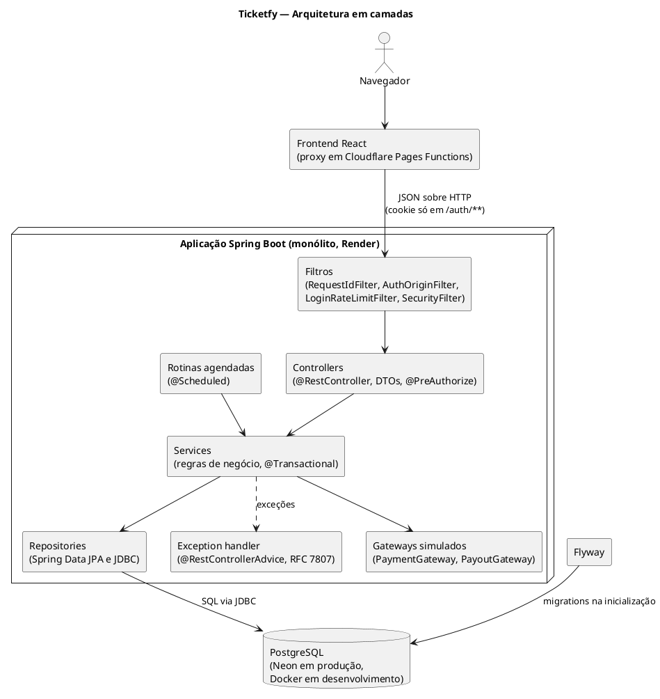
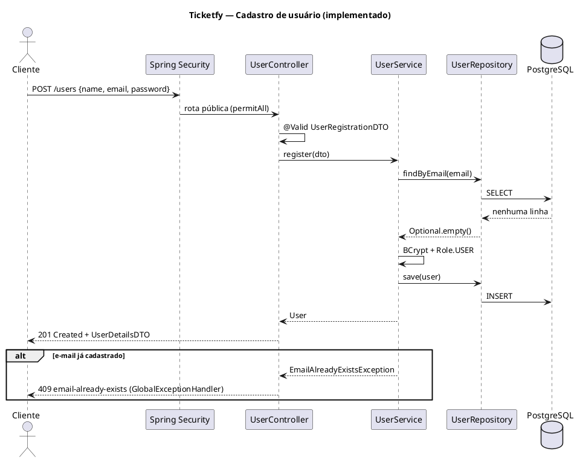
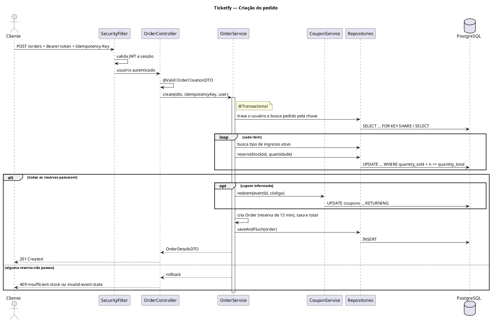

# Ticketfy 05 - Documento de Arquitetura

Oct 7, 2026

## Base desta documentação

Esta documentação descreve a arquitetura com base no código do repositório do Ticketfy, que é a fonte de verdade. Todos os domínios estão implementados: usuários, eventos, tipos de ingresso, cupons, pedidos, pagamentos, ingressos, painel, financeiro do organizador, auditoria, sessões e privacidade. O que ainda não foi implementado aparece como planejado, coerente com o [roadmap](ROADMAP.md).

### Tecnologias do projeto

| Tecnologia | Uso | Situação |
| --- | --- | --- |
| Java 17 | Linguagem do backend | Em uso |
| Spring Boot 4.1 | Framework da aplicação | Em uso |
| Spring Web | Exposição da API REST | Em uso |
| Spring Data JPA / Hibernate 7 | Mapeamento objeto-relacional e repositórios | Em uso |
| PostgreSQL 16 | Banco de dados relacional (Neon em produção) | Em uso |
| Flyway | Versionamento do esquema do banco | Em uso (V1 a V21) |
| Spring Security | Autenticação e autorização | Em uso |
| BCrypt | Hash de senhas | Em uso |
| java-jwt (Auth0) | Geração e validação dos access tokens JWT | Em uso |
| Bean Validation (Jakarta) | Validação dos dados de entrada | Em uso |
| Springdoc OpenAPI / Swagger UI | Documentação interativa da API e contrato `docs/openapi.json` | Em uso |
| Lombok | Redução de código repetitivo (`@Getter`, `@Setter`, construtores) | Em uso |
| Maven | Build e dependências | Em uso |
| JUnit 5, Testcontainers e JaCoCo | Testes com PostgreSQL real e cobertura mínima no build | Em uso |
| Docker e Docker Compose | Imagem multi-stage da aplicação e execução local da API com o banco | Em uso |
| GitHub Actions e Render | Integração contínua e hospedagem | Em uso |

O pagamento e a transferência dos saques são simulados, atrás das portas `PaymentGateway` e `PayoutGateway`. A integração com um provedor real (Pix com Asaas) está planejada; por isso, nenhum serviço externo de pagamento aparece nos diagramas.

## 1. Visão geral da arquitetura

O Ticketfy é uma aplicação monolítica em camadas, exposta como API REST e organizada em pacotes por domínio. Todo o backend roda em um único processo Spring Boot conectado a um único banco PostgreSQL.

A arquitetura combina três ideias:

- **Camadas:** cada requisição atravessa controller, service e repository, nessa ordem. Cada camada tem uma responsabilidade e só conversa com a camada imediatamente abaixo.
- **Pacotes por domínio:** em vez de agrupar todos os controllers em um pacote e todos os services em outro, cada domínio (`user`, `event`, `order` e assim por diante) reúne suas próprias classes de todas as camadas. O que muda junto fica junto.
- **REST stateless:** o servidor não guarda sessão. Cada requisição carrega o necessário para ser autenticada, o que deixa o backend independente do frontend que vier a consumi-lo.

### Princípios aplicados

| Princípio | Como aparece no Ticketfy |
| --- | --- |
| Separação de responsabilidades | O controller trata HTTP, o service aplica regras de negócio e o repository acessa o banco. No cadastro de usuário, por exemplo, quem decide o perfil e criptografa a senha é o `UserService`, e não o controller. |
| Injeção de dependência | O Spring cria e injeta as dependências pelo construtor: o `UserController` recebe o `UserService`, que recebe o `UserRepository` e o `PasswordEncoder`. Nenhuma classe instancia suas dependências com `new`. |
| Baixo acoplamento | Os controllers dependem de services, e não do banco. A API expõe DTOs, e não entidades, então mudanças no banco não quebram o contrato com o cliente. |
| Alta coesão | Cada pacote de domínio contém apenas o que diz respeito àquele conceito do negócio. |

### Por que essa arquitetura

O Ticketfy tem um único time, um único banco e um escopo acadêmico. Uma arquitetura em camadas dentro de um monólito atende esse cenário com pouca infraestrutura, transações locais no banco e um padrão amplamente documentado no ecossistema Spring. A organização por domínio prepara o projeto para crescer sem que os pacotes técnicos se tornem grandes demais.

## 2. Camadas do sistema

A requisição desce pelas camadas e a resposta sobe pelo mesmo caminho. Os pacotes `security` e `exception` atuam antes e depois desse caminho, para todos os domínios.

### Controller

Recebe as requisições HTTP, aciona a validação dos dados de entrada com `@Valid` e delega o trabalho ao service. Converte o resultado em `ResponseEntity`, com o status HTTP adequado. Não contém regra de negócio nem acessa o banco.

*No projeto:* `UserController` expõe `POST /users` para o cadastro público.

### Service

Concentra a lógica de negócio e coordena entidades e repositórios. É a camada onde ficam as transações (`@Transactional`), porque um caso de uso, como reservar estoque e criar um pedido, precisa ser gravado por inteiro ou não ser gravado.

*No projeto:* `UserService.register()` verifica se o e-mail já existe, criptografa a senha com BCrypt, define o perfil `USER` e salva o usuário.

### Repository

Interfaces do Spring Data JPA que fazem o acesso ao banco. As operações básicas (salvar, buscar por id, listar) vêm prontas de `JpaRepository`, e consultas específicas são declaradas pelo nome do método.

*No projeto:* `UserRepository.findByEmail(String email)` retorna `Optional<User>`.

### Entity (domínio)

Classes anotadas com `@Entity` que representam os conceitos do negócio e são mapeadas para tabelas. Usam `@Getter` e `@Setter` do Lombok em vez de `@Data`, para evitar problemas de `equals`, `hashCode` e `toString` com os proxies do JPA.

*No projeto:* `User` (tabela `users`) e o enum `Role`. O modelo completo está no documento de Diagrama de Classes.

### DTO

Records que definem o formato de entrada e saída da API. Separam o contrato público da estrutura interna e impedem dois problemas comuns: vazar campos sensíveis e permitir que o cliente preencha campos que não deveria.

*No projeto:* `UserRegistrationDTO` (entrada: nome, e-mail e senha, com validações) não tem o campo `role`, para que ninguém se cadastre como administrador. `UserDetailsDTO` (saída: id, nome e e-mail) não tem o campo `password`.

### Exception

Tratamento centralizado de erros com `@RestControllerAdvice`, convertendo exceções em respostas HTTP padronizadas.

*No projeto:* **implementado.** Toda resposta de erro segue a RFC 7807 (`ProblemDetail` do Spring), com `Content-Type: application/problem+json` e os campos:

| Campo | Conteúdo |
| --- | --- |
| `type` | URI estável do tipo de erro: `https://ticketfy-api.onrender.com/problems/<slug>` (propriedade `ticketfy.problems.base-uri`). |
| `title` | Resumo fixo do tipo de erro. |
| `status` | Código HTTP. |
| `detail` | Mensagem legível para o cliente, específica da ocorrência. |
| `instance` | Caminho da requisição que falhou. |

Erros de Bean Validation trazem também `errors`, com um item `{ field, message }` por campo inválido:

```json
{
  "type": "https://ticketfy-api.onrender.com/problems/validation-failed",
  "title": "Validation failed",
  "status": 400,
  "detail": "Validation failed",
  "instance": "/users",
  "errors": [
    { "field": "password", "message": "Password must be at least 8 characters long" }
  ]
}
```

Quem gera cada resposta:

- `GlobalExceptionHandler` (`@RestControllerAdvice`): exceções de negócio e do Spring MVC. O enum `ProblemType` concentra slug, título e status de cada tipo, e o `ProblemDetailFactory` monta a resposta.
- `JsonAuthenticationEntryPoint`: 401 `authentication-required` quando a rota exige token e ele falta ou é inválido.
- `JsonAccessDeniedHandler`: 403 `access-denied` negado pelo Spring Security. O 403 de `@PreAuthorize` também usa `access-denied`, só que pelo handler global.
- `LoginRateLimitFilter`: 429 `too-many-login-attempts`, com o cabeçalho `Retry-After`.
- `AuthOriginFilter`: 403 `auth-request-rejected` quando um `POST /auth/**` chega sem `Origin` permitido ou sem o header `X-Ticketfy-Auth: 1`.
- `AuthController`: 401 `session-expired` quando `POST /auth/refresh` recebe um refresh token ausente, vencido, revogado ou já usado; a resposta também apaga o cookie.
- `ProblemDetailErrorController`: substitui o `/error` do Spring Boot. Erros que escapam do MVC (por exemplo, exceção num filtro) viram um problem genérico por status, sem mensagem interna.

A lista completa de tipos, com o status e quando cada um acontece, está na [referência da API](API.md#erros).

O 500 genérico responde sempre `detail: "Internal server error"`. A exceção vai apenas para o log, e a resposta nunca expõe mensagem, stack trace ou nome de classe. Um status de erro sem tipo próprio que chegue ao `/error` responde com `type: about:blank` e o nome padrão do status.

### Security

Autenticação e autorização com Spring Security. Intercepta a requisição antes do controller e decide se ela pode seguir.

*No projeto:* **implementado.** O `SecurityConfig` define a política sem `HttpSession`, as rotas públicas e o `PasswordEncoder`; o `SecurityFilter` valida o access token e a sessão no banco; `@PreAuthorize` restringe as rotas por perfil (detalhes na seção 5).

### Config

Classes de configuração transversais, como os beans do Spring (`ClockConfig`, `SchedulingConfig`). O `SecurityConfig` fica no pacote `infra/config`, e as classes de autenticação (login, tokens e filtros) ficam no pacote `infra/security`. O `OpenApiConfig` define título, versão (lida do `build-info` do Maven), servidor de produção e o esquema `bearerAuth` do contrato OpenAPI; o `OpenApiExportTest` grava esse contrato em `docs/openapi.json` a cada build, e o CI falha se o arquivo commitado estiver desatualizado.

Variáveis de ambiente lidas pela aplicação:

| Variável | Padrão | Descrição |
| --- | --- | --- |
| `SPRING_PROFILES_ACTIVE` | `dev` | Perfil (`dev` ou `prod`) |
| `DB_URL` | `jdbc:postgresql://localhost:5432/ticketfy` | URL do banco |
| `DB_USERNAME` | `ticketfy_user` | Usuário do banco |
| `DB_PASSWORD` | — | Senha do banco (obrigatória) |
| `JWT_SECRET` | — | Chave de assinatura dos access tokens, com 32 ou mais caracteres (obrigatória) |
| `PAYOUT_ENCRYPTION_KEY` | chave fixa de desenvolvimento no perfil `dev` | Chave AES-256 em base64 que cifra documento e chave Pix (obrigatória em `prod`, que recusa a chave de desenvolvimento) |
| `PROXY_SHARED_SECRET` | vazio | Segredo do proxy do frontend para aceitar `X-Client-IP`, com 32 ou mais caracteres (obrigatório em `prod`) |
| `CORS_ALLOWED_ORIGINS` | `http://localhost:3000,http://localhost:5173` | Origens autorizadas, separadas por vírgula; também valem para a checagem de `Origin` em `/auth/**` |
| `DASHBOARD_TIME_ZONE` | `America/Sao_Paulo` | Fuso dos agrupamentos por dia e dos filtros por data |
| `ORDER_RESERVATION_MINUTES` | `15` | Duração da reserva de um pedido |
| `REFUND_DEADLINE_HOURS` | `48` | Antecedência mínima, em relação ao início do evento, para pedir reembolso |
| `LOGIN_MAX_ATTEMPTS` | `5` | Tentativas de login por IP na janela |
| `LOGIN_WINDOW_SECONDS` | `60` | Janela do limite de login |
| `PASSWORD_CONFIRMATION_MAX_ATTEMPTS` | `5` | Erros de senha de confirmação por usuário na janela (vale também para destinatários inexistentes na transferência) |
| `PASSWORD_CONFIRMATION_WINDOW_SECONDS` | `900` | Janela do limite de senha de confirmação |
| `TICKET_TRANSFER_MAX_PER_TICKET` | `3` | Transferências permitidas por ingresso |
| `COUPON_MAX_FAILED_ATTEMPTS` | `10` | Cupons inválidos por usuário na janela |
| `COUPON_WINDOW_SECONDS` | `900` | Janela do limite de cupons |
| `DATA_EXPORT_MAX_PER_WINDOW` | `3` | Exportações de dados por usuário na janela |
| `DATA_EXPORT_WINDOW_HOURS` | `24` | Janela do limite de exportações |
| `PLATFORM_FEE_PERCENT` | `5` | Taxa da plataforma sobre o valor pago, de 0 a 100 com até 2 casas |
| `PAYOUT_RELEASE_DELAY_DAYS` | `2` | Dias depois do fim do evento até o crédito ficar disponível |
| `PAYOUT_MIN_AMOUNT` | `20.00` | Valor mínimo de saque |
| `PAYOUT_KEY_CHANGE_COOLDOWN_HOURS` | `48` | Bloqueio de saques depois de trocar a chave Pix |
| `PAYOUT_STUCK_AFTER_MINUTES` | `10` | Tempo em processamento depois do qual a rotina reconsulta o saque |
| `PAYOUT_REVIEW_THRESHOLD` | `5000.00` | Saques acima deste valor passam por análise |

## 3. Diagrama de arquitetura

Todas as requisições passam pelo Spring Security antes de chegar a um controller, e a regra de negócio fica concentrada na camada de services.

&#91;embedded content: arquitetura do Ticketfy · 4 camadas, 1 banco, componente planejado tracejado\]

O diagrama embutido acima é da versão original, quando o exception handler ainda era planejado; o diagrama atual é o PlantUML abaixo. O Flyway não participa das requisições: ele aplica as migrations uma vez, quando a aplicação inicia. As rotinas agendadas (expiração de pedidos, retomada de cancelamentos de evento, processamento de saques e limpeza de sessões) chamam os services sem passar pelos filtros. Os gateways de pagamento e de saque são simulados; o provedor real (Pix com Asaas) está planejado.

### PlantUML



## 4. Fluxo de uma requisição

São mostrados dois fluxos implementados: o cadastro de usuário, o mais simples, e a criação do pedido na compra de ingresso, o que mais exercita transação e concorrência.

### 4.1 Cadastro de usuário (implementado)

&#91;embedded content: sequência do cadastro de usuário · fluxo implementado\]

Linhas cheias são chamadas; linhas tracejadas são retornos.

| Etapa | Componente | O que acontece |
| --- | --- | --- |
| 1 | Cliente | Envia `POST /users` com nome, e-mail e senha em JSON. |
| 2 | Spring Security | Confere que `/users` é rota pública e deixa a requisição seguir sem token. |
| 3 | `UserController` | Converte o JSON em `UserRegistrationDTO` e valida com `@Valid`. Dados inválidos são recusados com 400 antes de chegar ao service. |
| 4 | `UserService` | Consulta `findByEmail` para garantir que o e-mail ainda não existe (RN01). |
| 5 | `UserService` | Criptografa a senha com BCrypt e define o perfil `USER`. |
| 6 | `UserRepository` | Salva o usuário; o Hibernate gera o `INSERT` na tabela `users`. |
| 7 | `UserController` | Converte o usuário salvo em `UserDetailsDTO`, sem a senha, e responde 201. |

Se o e-mail já existir, o service lança `EmailAlreadyExistsException`, que o `GlobalExceptionHandler` converte em 409 no formato RFC 7807 (`type` terminado em `email-already-exists`). Dados inválidos respondem 400 `validation-failed`, com a lista `errors` por campo (veja a seção Exception).



### 4.2 Criação do pedido (implementado)

O recurso REST da compra é o pedido, então o endpoint é `POST /orders`, e não `POST /ingressos/compra`: em REST, a URL nomeia o recurso criado e o verbo HTTP indica a ação. O fluxo abaixo cobre a criação do pedido; o pagamento é a etapa seguinte (`POST /orders/{id}/payment`). O fluxo completo, com cupom, pedido de valor zero e erros, está no caso de uso UC01.

| Etapa | Componente | O que acontece |
| --- | --- | --- |
| 1 | Cliente | Envia `POST /orders` com o access token, a lista de tipos de ingresso e quantidades, o cupom opcional e o header opcional `Idempotency-Key`. |
| 2 | Filtros | O `SecurityFilter` valida o token e a sessão e identifica o usuário. Sem token válido, responde 401. Qualquer perfil autenticado pode comprar. |
| 3 | `OrderController` | Valida o `OrderCreationDTO` com `@Valid` e chama o service com o usuário autenticado. |
| 4 | `OrderService` | Abre a transação (`@Transactional`), trava a linha do usuário para conferir que a conta não foi excluída e, se a chave de idempotência já existe, devolve o pedido já criado. |
| 5 | `OrderService` | Para cada item, busca o tipo de ingresso ativo de evento ativo e não cancelado, confere que todos são do mesmo evento e que a quantidade respeita o `maxPerOrder` do tipo (RN13). |
| 6 | `TicketTypeRepository` | Reserva as unidades com um `UPDATE` condicional (`quantity_sold + n <= quantity_total`, evento ativo e não cancelado). Se nenhuma linha muda, o service responde 409, sem ler e travar a linha antes (RN12, RNF07). |
| 7 | `OrderService` | Cria o `Order` com seus `OrderItem`, registrando o preço unitário do momento (RN14). Consome o cupom, se houver, congela a taxa da plataforma e define o fim da reserva para 15 minutos depois (RN12). Se o total é zero, confirma o pedido e emite os ingressos. |
| 8 | Repositories | Gravam o pedido e os itens na mesma transação da reserva. Qualquer falha desfaz tudo, inclusive a reserva e o uso do cupom. Duas requisições com a mesma chave de idempotência esbarram na restrição de unicidade, e o controller devolve o pedido da primeira. |
| 9 | `OrderController` | Responde 201 com o `OrderDetailsDTO`, em situação `PENDING`, ou `PAID` no pedido de valor zero. |

Pedidos não pagos em 15 minutos são expirados pelo `OrderExpirationJob` (`@Scheduled`, a cada 60 segundos), que marca cada pedido como `EXPIRED` numa transação própria e devolve as unidades e o uso do cupom.



## 5. Segurança

A segurança usa Spring Security sem `HttpSession`. Senhas, validação de entrada, rotas públicas e autenticação por token com sessões revogáveis no banco estão implementadas.

| Aspecto | Mecanismo | Situação |
| --- | --- | --- |
| Senhas | Hash com BCrypt (`BCryptPasswordEncoder`, exposto como `@Bean PasswordEncoder`). A senha é criptografada no service antes de chegar à entidade e nunca é devolvida pela API. | Implementado |
| Validação de dados | Bean Validation nos DTOs: `@NotBlank`, `@Email`, `@Size(max = 150)` no e-mail e `@Size(min = 8)` na senha, ativados com `@Valid` no controller. | Implementado |
| Proteção contra elevação de perfil | O DTO de cadastro não tem `role`; o perfil é definido pelo `UserService` como `USER`. | Implementado |
| Sessão | O Spring Security segue `STATELESS` (sem `HttpSession`), mas cada login cria uma linha em `auth_sessions`, com limite absoluto de 12 h. O CSRF do Spring fica desligado, porque só as rotas `/auth/**` leem cookie, e elas têm proteção própria (linha CSRF). Ver DA14. | Implementado |
| Rotas públicas | `POST /users` (cadastro), `POST /auth/login`, `POST /auth/refresh` e `POST /auth/logout` liberadas com `permitAll()`; qualquer outra rota, inclusive `POST /auth/logout-all`, exige autenticação (`anyRequest().authenticated()`). | Implementado |
| Autenticação | `POST /auth/login` recebe e-mail e senha, o `AuthenticationManager` confere as credenciais e o `AuthSessionService` cria a sessão. A resposta traz um access token JWT de 10 min (java-jwt, HS256, `sub` = id do usuário, `sid` = id da sessão) e grava o refresh token no cookie `__Host-ticketfy_rt` (`HttpOnly`, `Secure`, `SameSite=Strict`, `Path=/`). O refresh token tem 32 bytes aleatórios, vale 30 min sem uso e o banco guarda só o SHA-256 dele. `POST /auth/refresh` troca o token por um sucessor; reapresentar um token já usado revoga a sessão inteira e grava auditoria. `POST /auth/logout` encerra a sessão do cookie, `POST /auth/logout-all` encerra todas as do usuário, e `PATCH /users/me/password` confere a senha atual, encerra todas e abre uma nova. Um job diário apaga sessões vencidas ou revogadas há mais de 7 dias. | Implementado |
| Tokens | O `SecurityFilter` lê o header `Authorization: Bearer <token>`, valida o JWT e busca a sessão pelo `sid` junto com o usuário, numa única consulta. Sessão revogada ou vencida responde 401 na hora, sem esperar o JWT expirar. | Implementado |
| CSRF | O `AuthOriginFilter` roda antes do Spring Security e recusa todo `POST /auth/**` sem `Origin` idêntico a uma origem de `ticketfy.cors.allowed-origins` ou sem o header `X-Ticketfy-Auth: 1` (403 `auth-request-rejected`). A comparação exata também barra os deploys de preview. | Implementado |
| IP do cliente | O front chega às rotas de sessão por um proxy em Cloudflare Pages Functions. O `ClientAddressResolver` só aceita o IP do header `X-Client-IP` quando o header `X-Proxy-Secret` confere com `PROXY_SHARED_SECRET` (comparação em tempo constante); fora isso, usa o endereço remoto. O limite de login (`POST /auth/login`) conta tentativas por esse IP. Em produção, a aplicação não sobe sem `PROXY_SHARED_SECRET` ou com `ticketfy.auth.cookie-secure=false`. | Implementado |
| Autorização por perfil | `User` implementa `UserDetails` e expõe o `role` como autoridade (`ROLE_USER`, `ROLE_ORGANIZER`, `ROLE_ADMIN`). As regras por perfil são declaradas por método com `@PreAuthorize`: por exemplo, criar evento, lote ou cupom e fazer check-in exigem `ORGANIZER` ou `ADMIN`; extrato, saldo, dados de recebimento e saques exigem `ORGANIZER`; destaque de evento, análise de saques e auditoria exigem `ADMIN`. | Implementado |
| Controle de acesso ao recurso | Os services conferem se o recurso pertence ao usuário: um cliente só vê os próprios pedidos e ingressos, e um organizador só gerencia os próprios eventos, lotes e cupons; o `ADMIN` passa por essas verificações. Pedido de outro usuário responde 404 `order-not-found`, para não revelar que existe; evento de outro organizador responde 403 `event-access-denied`. | Implementado |

O enum `Role` tem os três perfis, `USER`, `ORGANIZER` e `ADMIN`, protegidos por CHECK no banco (V12). O próprio usuário passa a organizador por `POST /users/me/organizer`. A compra não exige perfil específico: qualquer usuário autenticado compra, o que diverge da RN13 do Documento de Requisitos (I09).

## 6. Observabilidade

Cada requisição recebe um identificador que acompanha todos os logs gerados por ela.

| Aspecto | Mecanismo |
| --- | --- |
| Identificador da requisição | O `RequestIdFilter` roda antes de todos os outros filtros, inclusive do Spring Security e do limite de login. Ele aceita o header `X-Request-Id` do cliente quando o valor tem só letras, números e hífen, com até 64 caracteres; caso contrário, gera um UUID. O valor vai para o MDC (`requestId`) e volta no header `X-Request-Id` de toda resposta, inclusive em erros e no 429. |
| Usuário | Depois da autenticação, o `SecurityFilter` coloca no MDC o id do usuário (`userId`), nunca o e-mail ou o nome. |
| Log de acesso | Uma linha por requisição ao terminar: método, path sem query string, status e duração em ms. `/actuator/health` não gera essa linha. |
| Rotinas agendadas | A expiração de pedidos e o reprocessamento de cancelamentos colocam um `runId` próprio no MDC a cada execução. |
| Formato | No perfil `prod`, os logs saem em JSON no formato ECS (`logging.structured.format.console=ecs`), com `requestId`, `userId` e `runId` como campos. No perfil `dev`, mantêm o formato legível, com o identificador entre colchetes. |
| Erros 5xx | O ProblemDetail inclui a propriedade `requestId`, igual ao header, para o usuário informar o código ao suporte. O CORS expõe `X-Request-Id` para o front conseguir lê-lo. |
| Dados sensíveis | Não se registram o header `Authorization`, tokens, senhas nem corpos de requisição ou de resposta. |

## 7. Persistência

Os dados ficam em um único banco PostgreSQL, acessado pelo Spring Data JPA com Hibernate. O esquema é criado e alterado exclusivamente por migrations Flyway.

### Banco de dados

No desenvolvimento, o PostgreSQL roda em um contêiner definido no `docker-compose.yml`. As credenciais de conexão são lidas de variáveis de ambiente (`DB_URL`, `DB_USERNAME`, `DB_PASSWORD`), e não ficam gravadas no repositório.

### ORM e JPA

As entidades são mapeadas com anotações JPA (`@Entity`, `@Table`, `@Id`, `@Enumerated(EnumType.STRING)`). O enum é gravado como texto, e não como número, para que reordenar os valores no Java não corrompa os dados existentes. Cada entidade tem um construtor sem argumentos (`@NoArgsConstructor`), exigido pelo JPA.

### Migrations

O Flyway executa as migrations na inicialização da aplicação, em ordem de versão. Hoje existem as versões V1 a V21, sem a V7: de `V1__create-table-users.sql`, que cria a tabela `users` com e-mail único, a `V21__add_account_deletion.sql`. Cada novo domínio ou mudança ganha sua migration, e uma migration já aplicada nunca é editada: correções entram em uma nova versão. Regras que precisam valer mesmo fora da aplicação ficam no banco: CHECKs de status e valores, índices únicos parciais (um pagamento aprovado por pedido, um saque em andamento por organizador) e triggers que tornam append-only o extrato, as transferências e a auditoria.

### Repositories

Cada entidade tem uma interface que estende `JpaRepository`. O Spring gera a implementação em tempo de execução, inclusive para consultas derivadas do nome do método, como `findByEmail`.

### Relacionamentos entre entidades

Os relacionamentos são detalhados no Diagrama de Classes de Domínio. No mapeamento JPA, eles seguem quatro orientações:

- `@ManyToOne` com carregamento `LAZY` no lado "muitos" (por exemplo, `Order` → `User`), que vira uma chave estrangeira.
- Composições, como `Order` e seus itens, com `@OneToMany(mappedBy = ..., cascade = ALL, orphanRemoval = true)`, para que os itens sejam salvos e removidos junto com o pedido.
- Registros consultados por SQL próprio ou gravados uma única vez (extrato, saques, dados de recebimento, bloqueio de saques, transferências e o cupom do pedido) guardam só o `UUID` da outra ponta, com chave estrangeira no banco e sem `@ManyToOne`. A auditoria é gravada e lida por JDBC, sem entidade.
- Entidades nunca são serializadas diretamente na resposta: a conversão para DTO acontece dentro da transação, evitando erros de carregamento preguiçoso fora dela.

## 8. Organização do projeto

O projeto segue a organização por domínio, e não a separação em pastas `controller/`, `service/` e `repository/` no nível raiz. Dentro de cada pacote de domínio ficam as classes de todas as camadas daquele domínio.

### Estrutura atual

```text
src/
├── main/
│   ├── java/com/lutfy/ticketfy/
│   │   ├── audit/            log de auditoria append-only e consulta administrativa
│   │   ├── auth/             sessões revogáveis e refresh tokens rotativos
│   │   ├── coupon/           cupons de desconto, consumo condicional e limite de tentativas
│   │   ├── dashboard/        painéis do organizador
│   │   ├── event/            eventos, destaque e cancelamento
│   │   ├── infra/
│   │   │   ├── config/       beans transversais (Clock, agendamento, SecurityConfig)
│   │   │   ├── crypto/       SensitiveDataCipher e EncryptedStringConverter (AES-256-GCM)
│   │   │   ├── exception/    exceções de negócio e respostas Problem Details (RFC 7807)
│   │   │   ├── logging/      X-Request-Id e execução de rotinas (JobRun)
│   │   │   └── security/     login, tokens, filtros e confirmação de senha
│   │   ├── order/            pedidos, itens e expiração
│   │   ├── payment/          pagamentos e gateway simulado
│   │   ├── privacy/          exportação dos próprios dados e exclusão de conta (LGPD)
│   │   ├── payout/
│   │   │   ├── PayoutSettings  configuração de taxa, liberação e saque
│   │   │   ├── account/      dados de recebimento, validação de documento e chave Pix, máscaras
│   │   │   ├── admin/        análise de saques, bloqueio de organizador e DTOs de administração
│   │   │   ├── ledger/       extrato, saldo e exportação CSV
│   │   │   └── withdrawal/   solicitação, ciclo de vida, rotina e porta do gateway de saque
│   │   ├── ticket/           ingressos, validação e transferência
│   │   ├── tickettype/       tipos de ingresso e preços
│   │   ├── user/             usuários e perfis
│   │   └── ApiApplication
│   └── resources/
│       ├── application.properties, application-dev.properties, application-prod.properties
│       └── db/migration/     V1 a V21 (não há V7)
└── test/
    └── java/com/lutfy/ticketfy/   mesma estrutura de pacotes do main
docker-compose.yml
Dockerfile
pom.xml
```

### Estrutura planejada

A estrutura planejada já está implementada e é a mostrada acima. Em relação ao plano original, há duas diferenças:

- Os pacotes transversais `config`, `security` e `exception` ficam dentro de `infra/`, ao lado de `logging` e `crypto`, e não na raiz.
- Não há pacote `venue`: o local é guardado nos próprios campos do evento (`venueName`, `address`, `city`, `state`).

Cada pacote de domínio segue o mesmo padrão interno do `user`: entidade, enums, DTOs, repository, service e controller. Domínios maiores se dividem em subpacotes por assunto, como o `payout` (`account`, `ledger`, `withdrawal` e `admin`).

## 9. Decisões arquiteturais

As decisões abaixo já foram tomadas e aplicadas no projeto. Cada uma registra o motivo e a principal consequência.

| ID | Decisão | Motivo | Consequência |
| --- | --- | --- | --- |
| DA01 | Expor o backend como API REST. | Permitir que qualquer frontend, web ou móvel, consuma o sistema sem acoplamento ao servidor. | O frontend React foi desenvolvido sobre o contrato OpenAPI, que é gerado no build e conferido no CI; a publicação na Cloudflare Pages está planejada. |
| DA02 | Monólito em camadas (controller, service, repository). | Escopo acadêmico, um time e um banco: o padrão resolve o problema com pouca infraestrutura e é bem conhecido no ecossistema Spring. | Deploy simples e transações locais; todos os domínios compartilham o mesmo processo. |
| DA03 | Organizar pacotes por domínio, e não por camada técnica. | Manter juntas as classes que mudam juntas e permitir visibilidade package-private entre elas. | Cada domínio pode evoluir de forma isolada e ser extraído como módulo no futuro. |
| DA04 | Usar PostgreSQL como banco relacional. | O domínio tem relacionamentos fortes e exige consistência transacional, principalmente no controle de estoque de ingressos. | Integridade garantida por chaves estrangeiras e transações. |
| DA05 | Versionar o esquema com Flyway. | Tornar o banco reproduzível em qualquer máquina e registrar o histórico de alterações junto ao código. | Nenhuma alteração manual no banco; migrations aplicadas nunca são editadas. |
| DA06 | Autenticação stateless com JWT. | Dispensar sessão no servidor e manter a API independente do cliente. | Substituída em parte pela DA14: o JWT continua sendo o access token, mas dura 10 minutos e carrega o id de uma sessão guardada no banco, que pode ser revogada a qualquer momento. |
| DA07 | Usar DTOs (records) na entrada e saída da API. | Impedir vazamento de campos sensíveis e a alteração de campos protegidos, como `role`. | Exige conversão entre DTO e entidade em cada operação. |
| DA08 | Usar `@Getter` e `@Setter` do Lombok em vez de `@Data` nas entidades. | `@Data` gera `equals`, `hashCode` e `toString` que conflitam com proxies e relacionamentos do JPA. | Menos código repetitivo sem os riscos do `@Data`. |
| DA09 | Escrever código e mensagens de commit em inglês. | Seguir o padrão do mercado e a nomenclatura das bibliotecas usadas. | A documentação em português mantém um glossário com os termos equivalentes. |
| DA10 | Cancelar evento em duas etapas: marcar o evento como cancelado numa atualização condicional com commit próprio e depois processar cada pedido em transação separada (`REQUIRES_NEW`), reembolsando pelo mesmo fluxo do reembolso do comprador, que passa pela porta `PaymentGateway`. A reserva de estoque e o check-in checam o estado do evento no próprio `UPDATE`. Pedidos que falham continuam `PAID` ou `PENDING` e são retomados pela rotina `EventCancellationJob`; pedidos com ingresso já utilizado saem da rotina e exigem ação manual. | Uma falha de reembolso em um pedido não pode desfazer os demais nem o cancelamento, e depois do cancelamento nenhuma reserva nova pode passar. Manter um único caminho de reembolso evita regras divergentes. | O endpoint responde 200 com a contagem de pedidos reembolsados, cancelados, pendentes e que exigem ação manual. Reembolso duplicado é evitado pela transição `PAID` → `REFUNDED` com `@Version`, gravada antes da chamada ao gateway, e pelo ID do pagamento como chave de idempotência. Um pagamento confirmado durante o cancelamento é reembolsado pela rotina. |
| DA11 | Derivar o saldo do organizador de um extrato imutável (`organizer_ledger_entries`), sem guardar saldo. Cada pedido copia na criação o percentual da taxa da plataforma (`ticketfy.payout.platform-fee-percent`) e grava taxa (arredondada para centavos com HALF_UP) e líquido. O crédito de venda é gravado na mesma transação do pagamento e o débito de reembolso na mesma transação do reembolso, pelo fluxo único. Os estados a liberar, disponível (término do evento + `ticketfy.payout.release-delay-days`) e retido (evento cancelado) são calculados por consulta. | Um saldo atualizado no lugar pode divergir do histórico sem deixar rastro; com lançamentos imutáveis, qualquer valor pode ser reconstruído e auditado. | O banco garante um crédito e um débito por pedido (`UNIQUE (order_id, type)`) e rejeita `UPDATE`, `DELETE` e `TRUNCATE` no extrato por trigger. Correções futuras serão novos lançamentos. Pedidos anteriores à V15 ficaram com taxa 0 e receberam créditos e débitos retroativos. |
| DA12 | Saque do organizador como débito no extrato. A solicitação trava a linha de `payout_accounts` do organizador (`SELECT … FOR UPDATE`), confere senha, bloqueio após troca de chave, saldo e mínimo, e grava o saque e o débito `PAYOUT_DEBIT` na mesma transação; um índice único parcial em `payouts (organizer_id) WHERE status IN ('REQUESTED', 'PROCESSING')` garante no banco um único saque em andamento. Cancelamento e falha gravam o estorno `PAYOUT_REVERSAL`. Uma rotina processa cada saque em transações separadas e chama a porta `PayoutGateway` com o id do saque como chave de idempotência; saques presos em processamento são retomados consultando a transferência no provedor. Documento e chave Pix são cifrados com AES-256-GCM na aplicação, e o saque guarda uma cópia do destino. | Saques simultâneos não podem ultrapassar o saldo, uma falha entre a transferência e a gravação não pode pagar duas vezes, e dados pessoais não podem ficar legíveis num dump do banco. | O saldo disponível já desconta o saque em andamento, e o extrato continua imutável. A chave `PAYOUT_ENCRYPTION_KEY` é obrigatória em produção e não pode ser a chave fixa de desenvolvimento. Incluir um estado de análise exige ampliar a CHECK de status e recriar o índice parcial numa nova migration. |
| DA13 | Auditoria em tabela imutável (`audit_log`), gravada pelo `AuditService` na mesma transação da ação (`Propagation.MANDATORY`). Cada registro guarda o autor (usuário autenticado ou SYSTEM nas rotinas), a ação, o tipo e o id do alvo, detalhes em JSONB montados campo a campo, o `requestId` ou `runId` do MDC e a data. São auditados dados de recebimento, ciclo do saque (solicitado, enviado para análise, aprovado, recusado, cancelado, pago, falhou), bloqueio de saques, destaque de evento, preço de lote e cancelamento de evento. | Ações financeiras e administrativas precisam de rastro confiável de quem fez o quê, ligado aos logs da requisição, e o rastro não pode existir sem a ação nem a ação sem o rastro. | Um trigger rejeita `UPDATE`, `DELETE` e `TRUNCATE`. Os detalhes nunca contêm documento, chave Pix ou senha, nem mascarados. O ADMIN consulta a auditoria paginada com filtros por alvo, autor e período. Ações que não mudam nada (destacar um evento já destacado) não geram registro. |
| DA14 | Sessões no servidor com access token curto e refresh token rotativo em cookie. O login (`POST /auth/login`) cria uma sessão em `auth_sessions` (limite absoluto de 12 h) e devolve um JWT de 10 min com o id da sessão (`sid`); o refresh token (32 bytes aleatórios) vai no cookie `__Host-ticketfy_rt` (`HttpOnly`, `Secure`, `SameSite=Strict`, `Path=/`), vale 30 min de inatividade e só o SHA-256 dele fica em `refresh_tokens`. Cada `POST /auth/refresh` trava o token (`SELECT … FOR UPDATE`), emite um sucessor e marca o anterior como usado; reapresentar um token já usado revoga a sessão inteira (`REUSE_DETECTED`), sem janela de tolerância, e grava auditoria. O `SecurityFilter` confere a sessão a cada requisição. Logout, logout de todos os dispositivos e troca de senha (`PATCH /users/me/password`) revogam sessões no banco. As rotas `/auth/**` exigem `Origin` exato da lista de CORS e o header `X-Ticketfy-Auth: 1`. O front chega à API por um proxy em Cloudflare Pages Functions no mesmo site, que repassa o IP real em `X-Client-IP` com o segredo `X-Proxy-Secret`. | O JWT de 2 h guardado no navegador podia ser roubado por XSS, continuava válido depois do logout e não caía na troca de senha. Front (`*.pages.dev`) e API (`*.onrender.com`) estão em sites diferentes, e o Safari bloqueia cookies de terceiros. | Logout e troca de senha valem na hora, e um XSS não leva credencial de longa duração. Em produção a aplicação não sobe sem `PROXY_SHARED_SECRET` ou com `ticketfy.auth.cookie-secure=false`. O `POST /login` foi removido, e `POST /users/me/organizer` passou a responder 204 sem token. Um refresh cuja resposta se perde na rede derruba a sessão. Um job diário apaga as sessões vencidas ou revogadas há mais de 7 dias. Com domínio próprio, o mesmo cookie funciona sem proxy, mudando só o CORS (`allowCredentials`). |
| DA15 | Transferência de ingresso com dono próprio (`tickets.owner_id`, separado de `orders.user_id`). `POST /tickets/{id}/transfer` confere a senha (`PasswordConfirmation`), trava o evento (`SELECT … FOR SHARE`), depois o pedido (`SELECT … FOR UPDATE`), e troca dono e código num único `UPDATE` condicional (`owner_id` atual, `status = 'VALID'`, `transfer_count` abaixo de `ticketfy.ticket-transfer.max-per-ticket`, padrão 3). O código novo sai do mesmo gerador `SecureRandom` da emissão, e "evento já começou" usa o bean `Clock`. Cada transferência grava `ticket_transfers` (de quem, para quem, quando; sem código; append-only por trigger) e `audit_log` (`TICKET_TRANSFERRED`). O reembolso do comprador trava o mesmo pedido e responde 409 `order-has-transferred-tickets` se algum ingresso já foi transferido; o cancelamento do evento continua reembolsando o comprador e cancelando os ingressos pelo `order_id`, com qualquer dono. E-mail não cadastrado responde 422 genérico, consultado só depois da senha e de um ingresso válido, com limite de cinco falhas em 15 minutos por usuário. Pedido de outro usuário passou a responder 404 `order-not-found`. | A ordem de travas é sempre evento → pedido → ingresso, então transferência, check-in, reembolso e cancelamento se serializam sem deadlock: duas transferências simultâneas têm um vencedor; check-in e transferência nunca valem juntos, porque um muda o código ou o status que o outro exige; reembolso e transferência se excluem pelo lock do pedido; o cancelamento espera a transferência em andamento. | O código antigo deixa de valer no mesmo commit. O comprador vê no pedido o que comprou e pagou, mas não o código transferido; o destinatário vê o ingresso em `/tickets/me` e não acessa o pedido. Uma transferência bem-sucedida ainda confirma que o e-mail existe; o limite só impede varredura em massa. |
| DA16 | Cupom de desconto por evento (`coupons`) e pedido de valor zero. O código é gravado em maiúsculas, é único por evento (`UNIQUE (event_id, code)`) e imutável. O pedido congela `subtotal_amount`, `discount_amount`, `coupon_id`, `coupon_code` e `total_amount` (valor pago, `total = subtotal - desconto` garantido por CHECK); taxa e líquido são calculados sobre o valor pago, com o mesmo HALF_UP em centavos, e o desconto fixo é limitado ao subtotal. O uso é consumido num `UPDATE … RETURNING` condicional (ativo, validade, `uses_count < max_uses`) na transação da criação do pedido, depois da reserva de estoque, e o desconto é calculado com os valores devolvidos por esse `UPDATE`. Expiração e cancelamento de pedido pendente devolvem o uso; reembolso não devolve. `first_used_at` é gravado no primeiro uso e nunca volta a nulo: a partir dele um trigger recusa mudar tipo e valor e apagar o cupom, e a edição do organizador trava a linha (`SELECT … FOR UPDATE`). Código inválido, expirado, inativo, esgotado ou de outro evento responde 422 `invalid-coupon` com a mesma mensagem, na pré-visualização (`POST /events/{id}/coupons/preview`) e no `POST /orders`, e as falhas das duas rotas somam no limite de 10 em 15 minutos por usuário (`ticketfy.coupon.*`). Pedido com total zero (lote gratuito ou desconto integral) é confirmado na criação como `PAID`, com os ingressos emitidos na mesma transação, sem `payments` e sem lançamento no extrato. | Dois compradores disputando o último uso, um pedido expirando enquanto o cupom é desativado e o organizador editando enquanto um pedido usa o cupom passam todos pela trava da mesma linha, então só um leva o último uso, o contador nunca perde uma devolução (o contador e `first_used_at` não são escritos pelo JPA) e nenhum pedido sai com um desconto que não estava valendo no commit. | Pedido pendente mantém o desconto mesmo se o cupom for desativado depois. O reembolso e o cancelamento de evento de um pedido de valor zero seguem o fluxo único: ingressos cancelados e estoque devolvido, sem gateway nem débito. O dashboard mantém `revenue` no valor de face e acrescenta `discounts` e os usos por cupom; `total` em `/events/{id}/orders` passou a ser o valor pago, e pedidos sem pagamento contam em vendas por dia pela data de criação. O limite de tentativas é por instância, em memória. Lote gratuito permite que uma conta esgote o estoque com vários pedidos; só o limite por pedido segura isso. |
| DA17 | Exportação dos próprios dados e exclusão de conta por anonimização (pacote `privacy`). `POST /users/me/data-export` confere a senha (`PasswordConfirmation`), trava a linha do usuário (`SELECT … FOR UPDATE`) e devolve um JSON para download (`Content-Disposition: attachment`, `Cache-Control: no-store`) com perfil, pedidos (itens, valores, status, cupom e pagamentos), ingressos que o usuário possui, transferências enviadas e recebidas e, para organizador, eventos (lotes, cupons e totais agregados de vendas), saldo, extrato, saques e dados de recebimento. O limite é de 3 exportações a cada 24 h por usuário (`ticketfy.privacy.export.*`), contado pelos registros `DATA_EXPORTED` do `audit_log`; acima dele, 429 `too-many-data-exports` com `Retry-After`. `POST /users/me/deletion` exige a senha e `confirmation: "EXCLUIR"` e, numa única transação, trava nesta ordem a linha do usuário, os pedidos `PENDING` dele, a linha de `payout_accounts` e os lotes dos eventos dele (`FOR NO KEY UPDATE`). Depois recusa com 409 e um `type` por caso: ADMIN (`admin-account-deletion`), saques bloqueados (`account-has-payout-block`), saque em análise, solicitado ou em processamento (`account-has-payout-in-progress`), saldo a liberar, disponível ou retido diferente de zero (`account-has-balance`, com os três valores), evento não cancelado com lote vendido antes do fim ou com pedido pendente (`account-has-active-events`, com os ids) e ingresso válido de evento não cancelado que ainda não terminou (`account-has-upcoming-tickets`). Passando as verificações: cancela os pedidos pendentes (devolve estoque e uso de cupom), desativa todos os eventos do usuário, apaga `payout_accounts`, revoga todas as sessões (`ACCOUNT_DELETED`) e substitui nome por `Usuário excluído`, e-mail por `deleted-<id>@deleted.ticketfy.invalid`, foto por nulo e senha pelo bcrypt de um segredo aleatório descartado, gravando `deleted_at`. A auditoria `ACCOUNT_DELETED` guarda só contagens. | Os registros financeiros e de auditoria precisam continuar somando o mesmo, e as tabelas append-only (`organizer_ledger_entries`, `ticket_transfers`, `audit_log`) não aceitam `DELETE`; por isso a conta é anonimizada e não apagada, e todo o resto continua ligado ao mesmo id. Fluxos que gravam dados ligados ao usuário (criação de pedido e de evento, pagamento, solicitação de saque, dados de recebimento, troca de senha e foto, virar organizador e o destinatário de uma transferência) passam a travar a linha do usuário antes de qualquer outra (`FOR KEY SHARE` ou `FOR UPDATE`, conferindo `deleted_at IS NULL`); a exclusão usa `FOR UPDATE`, então os dois se serializam sem deadlock: se a exclusão vence, o outro fluxo recebe 401 `session-expired`; se o pagamento de um pedido pendente vence, a exclusão vê os ingressos e recusa. A justificativa de reter os dados financeiros cita a LGPD (art. 7º, II, e art. 16, I, obrigação legal ou regulatória) e o prazo de guarda de documentos contábeis e fiscais; essa leitura é uma justificativa técnica sujeita a validação jurídica e não afirma conformidade com a lei. | O e-mail original fica livre para um novo cadastro, e o cadastro recusa o domínio `deleted.ticketfy.invalid` (400 `email-not-allowed`). Documento e chave Pix saem completos na exportação, e não mascarados, porque ela atende ao acesso do titular aos dados como estão guardados; a máscara continua em todas as outras respostas. Na exportação, uma transferência mostra só direção, data, evento e lote: nem e-mail, nem nome, nem id da outra conta, e o ingresso enviado não sai com o código. Os saques mantêm documento e chave Pix cifrados e o titular (`holder_name`, em texto puro) em todos os status, e o ADMIN continua vendo o titular; não há rotina de expurgo depois do prazo de retenção (pendência L09). Os eventos do organizador excluído somem da busca e de `GET /events/{id}`; pedidos e ingressos dos compradores continuam mostrando nome e data do evento. Em listas de terceiros (pedidos no dashboard, auditoria), o usuário excluído aparece como `Usuário excluído` com o e-mail placeholder. |

## 10. Benefícios da arquitetura

| Aspecto | Como a arquitetura favorece |
| --- | --- |
| Manutenção | Uma mudança em pedidos fica dentro do pacote `order`, e uma mudança de regra fica no service, sem tocar controller ou banco. |
| Testabilidade | Com injeção de dependência pelo construtor, o service pode ser testado com repositórios simulados (mocks), sem subir o banco. Regras dentro das entidades podem ser testadas como Java puro. |
| Organização | Todos os domínios seguem o mesmo padrão interno, o que torna o projeto previsível para quem chega a ele pela primeira vez. |
| Reutilização | Segurança, tratamento de erros e configuração ficam em pacotes transversais e valem para todos os domínios, sem repetição. |
| Evolução | Novos domínios entram como novos pacotes e novas migrations. A separação por domínio permite evoluir para um monólito modular sem reescrever o sistema. |

## 11. Limitações

A arquitetura atende ao escopo acadêmico, mas tem limitações conhecidas.

| ID | Limitação | Impacto |
| --- | --- | --- |
| L01 | Resolvida: login, access token JWT, refresh token e sessões revogáveis estão implementados (DA14). | — |
| L02 | Resolvida: os erros seguem a RFC 7807 com `type` estável por tipo de erro (seção Exception). Os textos de `detail` são em inglês e não são traduzidos pela API. | O frontend precisa usar o `type`, o status ou `errors` para mostrar mensagens próprias em português. |
| L03 | Resolvida: o enum `Role` tem o perfil `ORGANIZER`, e a autorização por perfil está implementada (seção 5). Continuam não implementadas a suspensão de contas pelo `ADMIN`, a desativação de lotes e a lista de participantes por ingresso. | Listadas em "Possíveis melhorias" no [roadmap](ROADMAP.md). |
| L04 | Os services dependem diretamente dos repositories JPA. | Testar regras de negócio exige simular os repositórios; o domínio não é totalmente independente da persistência. Para o porte do projeto, é uma troca aceitável. |
| L05 | Por ser um monólito, todos os domínios escalam juntos e uma falha grave afeta o sistema inteiro. | Aceitável para o volume de um projeto acadêmico. |
| L06 | Resolvida: cada access token carrega o id da sessão, e o `SecurityFilter` confere a sessão no banco a cada requisição (DA14). Logout, logout de todos os dispositivos, troca de senha e exclusão da conta (DA17, motivo `ACCOUNT_DELETED`) valem na hora. | Ainda não existe revogação de sessões nem desativação de conta por um ADMIN; quando existirem, devem revogar as sessões do usuário pelo `AuthSessionService`. |
| L07 | O pagamento e a transferência dos saques são simulados, atrás das portas `PaymentGateway` e `PayoutGateway`. A integração com o Asaas (Pix) está planejada; cartão de crédito não está no roadmap. | Nenhum dinheiro real circula. A confirmação assíncrona do provedor e o pagamento aprovado depois da expiração da reserva (Q08 do Documento de Requisitos) ainda não foram tratados. |
| L08 | Resolvida: a aplicação tem imagem Docker multi-stage, com usuário sem privilégios, e o `docker-compose.yml` sobe a API junto com o banco. | — |
| L09 | Pendente de revisão jurídica: a retenção do destino dos saques (documento e chave Pix cifrados e `holder_name` em texto puro) em todos os status depois da exclusão da conta, o prazo de retenção citado como justificativa (DA17) e o texto da página de privacidade do frontend. Não existe rotina de expurgo dos dados retidos depois do prazo. | Até a revisão, nada na documentação ou no produto deve afirmar conformidade com a LGPD. Os dados retidos ficam guardados por tempo indeterminado. |

### Evoluções futuras sugeridas

As evoluções sugeridas na versão original já foram feitas: o pacote `exception` com respostas RFC 7807 (L02), o controle de estoque por `UPDATE` condicional, os testes de integração com Testcontainers e a imagem Docker da aplicação (L08).

Os itens abaixo não fazem parte do código atual. Os planejados seguem o [roadmap](ROADMAP.md):

- **Planejado:** idioma preferido salvo na conta.
- **Planejado:** adicionar o evento à agenda com arquivo `.ics`.
- **Planejado:** e-mails transacionais com Brevo.
- **Planejado:** pagamento via Pix com Asaas, substituindo o gateway simulado (L07).
- **Planejado:** publicar o frontend na Cloudflare Pages.
- **Planejado:** login com Google.
- **Planejado:** monitoramento de erros com Sentry.
- **Planejado:** upload de foto de perfil e de capa de evento, hoje informadas como endereço https.
- **Planejado:** teste de carga com k6.
- **Evolução futura sugerida:** evoluir para um monólito modular, com fronteiras entre módulos verificadas por ferramentas como o Spring Modulith, se o projeto crescer.
